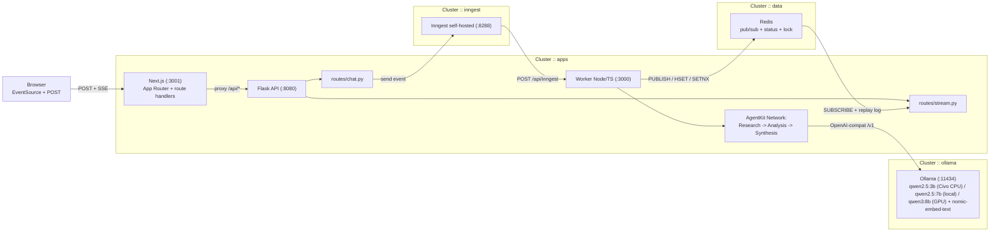
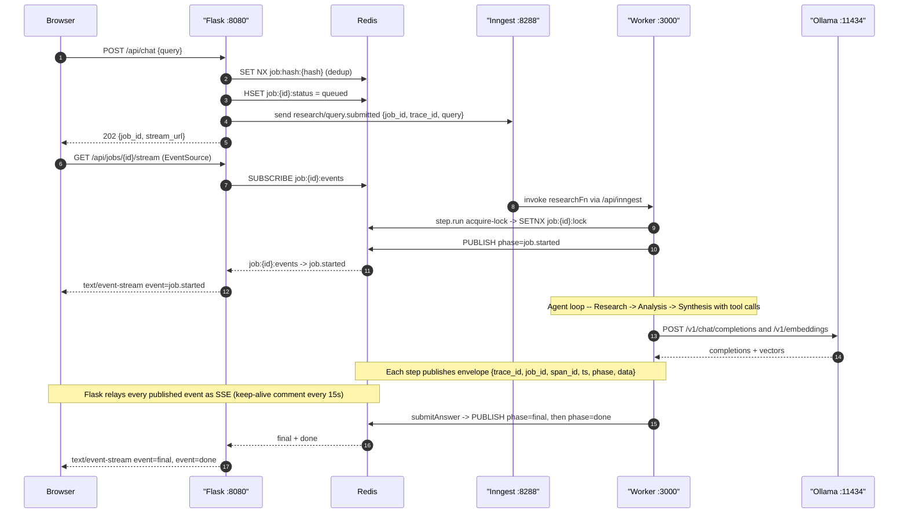
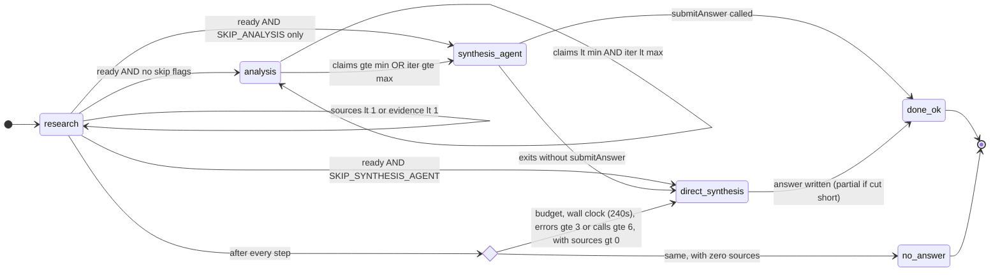

# Civo LLM Boilerplate — Async Research Agent

> A production-shaped implementation of the Grow Factory assessment brief.
> Flask API + Inngest AgentKit agent network over self-hosted Ollama on a Civo
> Kubernetes cluster. SSE streaming, per-job RAG, idempotent job dedup, full
> observability.
>
> **What actually runs on the live CPU deployment:** a ResearchAgent (web search +
> fetch, inside an AgentKit network) followed by a direct synthesis completion.
> The full Research → Analysis → Synthesis three-agent network is built and
> tested, but the Analysis and Synthesis agents are switched off on the 4 vCPU
> node (`SKIP_ANALYSIS`, `SKIP_SYNTHESIS_AGENT`) because each extra model call
> costs a minute or more there. [ADR-010](docs/adr/010-single-step-network-and-direct-synthesis.md) has the reasoning.

Forked from `growAssignments/_llmBoilerGrow2025` — upstream commits preserved.

---

## Live demo endpoints

Populated from `terraform output` after `apply`. IPs from the live deployment as of 2026-09-14 (Civo LON1, one `g4s.kube.large` CPU node, `qwen2.5:3b`); they change whenever the cluster is rebuilt:

| Purpose | Example |
|---|---|
| **UI (Next.js 15 + React 19)** | <http://74.220.20.76> |
| Flask API root | <http://74.220.16.132> |
| POST endpoint | `http://74.220.16.132/api/chat` (direct) or `http://74.220.20.76/api/chat` (proxied via Next.js route handler) |
| Job stream (SSE) | `http://74.220.16.132/api/jobs/<id>/stream` |
| Inngest dashboard | <http://74.220.20.104> (also on `:8288`) |
| Open WebUI (Ollama) | <http://74.220.23.41> |

## Run it in five steps

The shortest path from a fresh machine to a working answer. You need Docker Desktop (or Docker Engine with the Compose plugin) and about 6 GB of free disk. Nothing else is installed on your machine; everything runs in containers.

```bash
# 1. Get the code
git clone https://github.com/kasasa22/_llmBoilerGrow2025
cd _llmBoilerGrow2025

# 2. Start the six services (first run builds three images: 3-5 minutes)
docker compose up --build -d

# 3. Download the two models into the Ollama container (one time, ~5 GB, 5-15 minutes)
docker compose exec ollama ollama pull qwen2.5:7b
docker compose exec ollama ollama pull nomic-embed-text

# 4. Check everything is healthy (worker and web report "unhealthy" until step 3 finishes)
docker compose ps

# 5. Ask a question
open http://localhost:3001        # or paste it into a browser
```

Type a factual question such as `What is a Kubernetes DaemonSet?` and press Send. On a laptop CPU the first answer takes 3-6 minutes because the model is loading; later answers take 2-4 minutes. You will see the agent search, read a page, and then write a cited answer. The Inngest dashboard at <http://localhost:8288> shows the same run as a step tree.

To stop: `docker compose down` (keeps the downloaded models). To start again later: `docker compose up -d`.

If a step fails, jump to [Troubleshooting](#troubleshooting). The rest of this README explains what you just ran and how to deploy it to Civo. If you have `make` installed, every command above has a shortcut (`make up`, `make pull-models`, `make ps`, `make down`); see the [local quickstart](#quickstart--local).

## Architecture

### System topology



State lives entirely in Redis:
`job:{id}:status` (HASH) · `job:{id}:events` (pub/sub) · `job:{id}:log` (LIST replay) · `job:{id}:lock` (SETNX + heartbeat) · `job:{id}:final` (terminal envelope).

Every log line + Redis envelope carries `{trace_id, job_id, span_id, parent_span_id, ts, phase}`.
See [`scripts/trace.sh`](scripts/trace.sh) for correlated tail.

### Request lifecycle



## The agent

**What it does (for a user):** takes a factual research question, searches the open web for authoritative sources, reads the top pages, and returns a cited answer as markdown with `[1]`, `[2]` reference links you can click. Not a general chatbot — it's optimised for "explain / define / compare" style queries where a cited answer beats a raw LLM guess.

### Sample queries that work well

- *"What is Ollama and what does it do?"*
- *"What is Server-Sent Events and when should you use it?"*
- *"Compare Redis Streams and Redis Pub/Sub."*
- *"What is a Kubernetes DaemonSet?"*
- *"What are the main features of Civo GPU Kubernetes clusters?"*

### Sample run (CPU, `qwen2.5:7b`, laptop 4-core i7)

`POST /api/chat {"query":"Compare FastAPI vs Express"}` → 313 s wall clock, 17 SSE events, each stage exactly once:

```text
job.started → tool.called(webSearch) → research.search_completed → tool.result
→ tool.called(fetchUrl) → research.source_found → rag.chunks_indexed → tool.result
→ tool.called(fetchUrl) → research.source_found → rag.chunks_indexed → tool.result
→ agent.transition(research→synthesis) → synthesis.started → rag.retrieved
→ synthesis.answer_ready → final → done
```

`final.data` (abridged; `partial: false`, `mode: "direct"`, 2 citations):

```markdown
| Dimension          | FastAPI (Python)                     | Express (Node.js)                        |
|--------------------|--------------------------------------|------------------------------------------|
| Performance        | Extremely fast APIs                  | Excellent for I/O-heavy apps             |
| Learning Curve     | Easy if familiar with Python         | Easy if familiar with JavaScript         |
| Ecosystem          | Rich Python AI/ML libraries          | Massive npm package support              |
| Best Use Cases     | APIs, microservices, ML integrations | Real-time apps, SaaS, e-commerce         |

### Which to Choose
- **FastAPI** is ideal for projects that require high performance, especially in
  data-intensive or AI-powered applications. ...
- **Express** is better suited for real-time applications, SaaS, and e-commerce ...
```

Citations: `[1]` slincom.com "Backend Battle 2025: FastAPI vs Express Explained", `[2]` kunalganglani.com "FastAPI vs Express 2026". Synthesis alone: 825 prompt tokens, 250 output tokens, 158 s at 3.4 tok/s. The research turns after the first reused 516 cached prefix tokens (Ollama `cached n_tokens`).

### What it deliberately doesn't do

- **Multi-turn conversation**: each `POST /api/chat` is single-shot. There's no session or memory across queries — by design, so responses stay reproducible under `Idempotency-Key`. Cross-session memory is called out as the next upgrade path in [ADR-006](docs/adr/006-hybrid-rag-in-memory-vs-vectordb.md).
- **Opinion or preference queries** ("what's the best…?"): the agent will search, but small-model synthesis is unreliable at value judgements.
- **Real-time data** (stock prices, live scores): source pages may be stale.

### Agent architecture

An [AgentKit Network](https://agentkit.inngest.com/concepts/networks) behind a hybrid router, followed by a direct synthesis completion. The whole pipeline runs inside **one** Inngest step (`run-agent-network`) so it executes exactly once per job; see [ADR-010](docs/adr/010-single-step-network-and-direct-synthesis.md) for why that matters.

- **ResearchAgent** — tools `webSearch`, `fetchUrl`. Gathers 1-2 primary sources on CPU deploys (2 for comparison questions), up to 4 on GPU. Every fetched page is chunked and embedded into the per-job RAG store.
- **AnalysisAgent** *(optional, `SKIP_ANALYSIS=false`)* — tools `extractClaim`, `rateSourceCredibility`. Emits atomic claims + credibility scores.
- **SynthesisAgent** *(optional, `SKIP_SYNTHESIS_AGENT=false`)* — tool `submitAnswer` (terminal). Receives the retrieved evidence in its system prompt and writes the answer as a tool call.
- **Direct synthesis** *(default on CPU, and the fallback whenever the SynthesisAgent exits without `submitAnswer`)* — one plain `POST /api/chat` on Ollama with the top-K retrieved chunks, numbered sources, a `num_predict` cap and a timeout carved out of the wall clock (`SYNTHESIS_TIMEOUT_MS`). Small models are far more reliable at writing 300 words of prose than at packing them into JSON tool-call arguments, so this path produces the cited answer on the CPU deployment.

The default CPU pipeline is therefore **ResearchAgent → direct synthesis**. Flip `SKIP_ANALYSIS` / `SKIP_SYNTHESIS_AGENT` to `false` on a GPU node to run the full Research → Analysis → Synthesis network.

### Agent decision policy

Each agent runs a dynamic system prompt rebuilt per turn from the current `NetworkState` + `BudgetTracker` snapshot. The policy the ResearchAgent actually follows:

1. **Only `fetchUrl` produces evidence.** A search alone doesn't advance the pipeline; always follow a search with a fetch.
2. **Only fetch URLs returned by `webSearch` this run.** Never invent or guess a URL.
3. **Rank results**: official docs / project site > primary reporting, `.gov`, `.edu` > everything else. Skip forums, SEO listicles, aggregators. One fetch per domain unless the budget allows more.
4. **Comparison queries** (`compare`, `vs`, `versus`, `difference between`): fetch one source per side before stopping.
5. **One tool call per turn.** No prose. When the goal is met or the budget is exhausted, reply `DONE`.
6. **The prompt shows remaining budget** (`webSearch calls left: N`, `fetchUrl calls left: M`) and **already-fetched URLs** so the model plans within actual constraints — not hallucinated ones.

Synthesis (the direct completion on CPU, or the SynthesisAgent on GPU) follows the same policy: a markdown answer of 120-250 words, one direct opening sentence, inline `[n]` citations that map to the numbered source list, and for comparison questions a recommendation paragraph followed by a table. Citations are always derived from the pages the agent actually fetched; a URL the model invents can never appear as a link.

Router transitions (all thresholds env-tunable via `NETWORK_MIN_*` / `NETWORK_MAX_*`):

- `research → analysis` when `sources ≥ NETWORK_MIN_SOURCES && rawEvidence ≥ NETWORK_MIN_EVIDENCE` (the source floor rises to 2 for comparison questions when `MAX_FETCHES ≥ 2`).
- `analysis → synthesis` when `claims ≥ NETWORK_MIN_CLAIMS || iteration ≥ NETWORK_MAX_ANALYSIS_ITERS`.
- Set `SKIP_ANALYSIS=true` to bypass the analysis phase (used on CPU deploys where each model call is expensive).
- Set `SKIP_SYNTHESIS_AGENT=true` to end the network as soon as research is ready and write the answer with the direct synthesis completion instead of the SynthesisAgent (default on CPU).
- Terminate on: `submitAnswer` called, `callCount ≥ NETWORK_MAX_CALLS`, research wall clock exhausted (`MAX_WALL_CLOCK_MS`), or `errors.length ≥ 3`. Whatever the exit reason, if at least one source was fetched the direct synthesis still runs (its own `SYNTHESIS_TIMEOUT_MS` clock) and a cited answer is produced.

Model: `qwen2.5:3b` on the Civo CPU node (Terraform `cpu_model_name`), `qwen2.5:7b` on local docker-compose, `qwen3:8b` on GPU deploys. Toggle via `ENABLE_GPU` (see [ADR-004](docs/adr/004-model-choice-qwen3-8b.md)). The 3b model was chosen for the cluster because the 4 vCPU / 8GB node runs 7b at roughly half the speed and with little memory headroom; the direct synthesis completion does the writing, so the small model only has to pick sources. The worker pre-loads both models at boot and Ollama keeps them resident (`OLLAMA_KEEP_ALIVE`), so the first demo query is not the slowest.

### Network state machine

Thresholds shown are the deployed CPU values (`NETWORK_MIN_SOURCES=1`, `NETWORK_MIN_EVIDENCE=1`, `MAX_WALL_CLOCK_MS=240000`, both skip flags on). The dashed analysis and synthesis-agent states only run when the skip flags are off (GPU profile).



## Quickstart — local

Prerequisites: Docker with Compose v2 (`docker compose version`), about 8 GB of free RAM and 6 GB of disk for the models. Runs entirely on CPU; a GPU only speeds up inference. Node 22 and Python 3.12 are needed only if you want to run the unit tests outside Docker (see [Running the tests](#running-the-tests)).

```bash
git clone https://github.com/kasasa22/_llmBoilerGrow2025
cd _llmBoilerGrow2025

# 1. (Optional) create a .env file at the repo root to override defaults.
#    Without it the stack runs with the values in docker-compose.yml, which are the
#    tested CPU settings. The full list of knobs is in "Environment variables" below.
cat > .env <<'EOF'
MODEL_NAME=qwen2.5:7b
LOG_LEVEL=info
EOF

# 2. Bring the full stack up (ollama + redis + inngest dev + worker + flask + web)
make up

# 3. Pull the chat + embedding models on first run (qwen2.5:7b ~4.7 GB, nomic ~274 MB).
#    Until this finishes `make ps` shows worker and web as unhealthy: the worker's
#    readiness check requires both models to be present. That is expected.
make pull-models
# Smaller/faster on a weak CPU: `CHAT_MODEL=qwen2.5:3b make pull-models` and set MODEL_NAME=qwen2.5:3b in .env
# Bigger on a GPU:              `CHAT_MODEL=qwen3:8b make pull-models`   and set MODEL_NAME=qwen3:8b

# 4. Open the UI
#    Next.js UI:              http://localhost:3001
#    Flask API root:          http://localhost:8080   (JSON — no HTML front-end)
#    Inngest dashboard:       http://localhost:8288
#    Ollama Open WebUI:       http://localhost:3000
#    Ollama server (raw API): http://localhost:11434

# 5. Smoke test end-to-end (POST → SSE tail → assert final)
make smoke

# 6. Idempotency smoke (double-POST + worker-crash takeover)
make smoke-idem

# 7. Run the eval harness
make eval    # writes eval/results/<date>.md

# Shut down (keeps model volumes so next `up` is instant)
make down
```

The `.env` file is optional — docker-compose defaults kick in if it's missing — but you'll want it to tune budgets for slower CPUs or bump limits for GPU.

What you should see: `make up` prints six healthy containers; `make pull-models` downloads for a few minutes on first run; the first query in the UI at <http://localhost:3001> takes 3-6 minutes on a laptop CPU (the model is cold), later ones 2-4 minutes. The Inngest dashboard at <http://localhost:8288> shows one run per query with a `run-agent-network` step.

### Running the tests

All three suites run in CI on every push (`lint-node.yml`, `lint-web.yml`, `lint-python.yml`). To run them locally:

```bash
# Worker (TypeScript, vitest): 164 tests
make worker-install       # npm install in app/worker, once
make worker-typecheck
make worker-test

# Web (Next.js, vitest + Testing Library): 31 tests
cd web && npm ci --legacy-peer-deps && npx tsc --noEmit -p tsconfig.json && npx vitest run && cd ..

# Flask (pytest with an in-memory fake Redis, no services needed): 39 tests
python3 -m venv .venv && source .venv/bin/activate
pip install -r app/requirements-dev.txt
make py-test
make lint-py              # the same flake8 selection CI uses

make test                 # worker-test + py-test together
```

`scripts/smoke.sh` and `scripts/smoke-idempotency.sh` are the end-to-end checks; they need a running stack (`make up`) or a cluster URL (`FLASK_URL=http://<chat_url>`).

## Configuring Inngest

Inngest sits between Flask and the worker. Flask **sends** one event per query; the worker **serves** one function that Inngest invokes over HTTP. Two apps are registered with Inngest, `bosmart-flask` (sender) and `bosmart-worker` (function host); the app id is `INNGEST_APP_ID` on each side.

| Variable | Flask | Worker | Purpose |
|---|---|---|---|
| `INNGEST_BASE_URL` | yes | yes | Where the Inngest server is. `http://inngest:8288` in Compose, `http://inngest.inngest.svc.cluster.local:8288` on the cluster. |
| `INNGEST_EVENT_KEY` | yes | yes | Authorises **sending** events. Flask uses it on every `POST /api/chat`. |
| `INNGEST_SIGNING_KEY` | yes | yes | Lets the worker **verify** that function invocations really come from Inngest, and lets Inngest register the worker's functions. |
| `INNGEST_APP_ID` | `bosmart-flask` | `bosmart-worker` | Shown in the dashboard under Apps. |
| `INNGEST_SERVE_PATH` | — | `/api/inngest` | The worker route Inngest polls and invokes. |

**Locally** the Compose file runs the Inngest **dev server** (`inngest dev --sdk-url http://worker:3000/api/inngest`). The dev server does not check keys, so the `.env` placeholder `INNGEST_EVENT_KEY=dev-key` is enough and the signing key can stay empty. It discovers the worker by polling the `--sdk-url`; you will see a `PUT /api/inngest` line in `make logs S=worker` every few seconds, which is the registration handshake, not an error.

**On the cluster** the Helm chart runs the **self-hosted single binary** (`inngest start`) with persistence on a 2 GB volume. Self-hosted mode requires both keys, as raw hex, and the same two values are given to three releases: the Inngest server (its Secret), the worker, and the Flask app. Generate them once:

```bash
openssl rand -hex 32     # INNGEST_EVENT_KEY
openssl rand -hex 32     # INNGEST_SIGNING_KEY
```

Put them in `infra/tf/terraform.tfvars` for a local `terraform apply`, or in the GitHub secrets `INNGEST_EVENT_KEY` and `INNGEST_SIGNING_KEY` for CI. Terraform passes them into the Helm values as `set_sensitive`, and the charts render them as Kubernetes Secrets mounted as env. Do not use a key copied from Inngest Cloud: the `signkey-prod-…` format is Cloud-only and the self-hosted binary rejects it with `signing-key must be hex string`. The dashboard (`inngest_dashboard_url` output; served on port 80 and 8288 because some networks block non-standard ports) has no login in the OSS build; see [ADR-002](docs/adr/002-self-hosted-inngest-vs-cloud.md).

No Inngest Cloud account is needed at any point.

## Quickstart — Civo Kubernetes

Prereqs: [Civo account](https://dashboard.civo.com/signup) + API key, Terraform ≥ 1.9, `kubectl`, a [Terraform Cloud](https://app.terraform.io) free account.

### 1. Terraform Cloud workspace (one-time)

1. Sign in at [`app.terraform.io`](https://app.terraform.io) → **New organization** (any name, e.g. `myorg-llm`).
2. **New workspace** → **CLI-driven** → name it `llm-boilerplate`.
3. Workspace → **Settings** → **General** → **Execution Mode** = **Local (custom)** → **Save settings**.
   *State is stored in TF Cloud, apply runs on your machine — required so `kubectl`/`helm` can reach your cluster.*
4. Top-right avatar → **Account settings** → **Tokens** → **Create an API token** → copy it.
5. `terraform login` locally → paste the token when prompted.

### 2. Update providers.tf

Edit [`infra/tf/providers.tf`](infra/tf/providers.tf) to point at your workspace:

```hcl
cloud {
  organization = "myorg-llm"          # your org name from step 1
  workspaces {
    name = "llm-boilerplate"          # your workspace name
  }
}
```

### 3. Configure secrets

```bash
cp infra/tf/terraform.tfvars.example infra/tf/terraform.tfvars
# Edit infra/tf/terraform.tfvars and set:
#   civo_token          = "<your Civo API token>"
#   inngest_event_key   = "<32-hex; run: openssl rand -hex 32>"
#   inngest_signing_key = "<32-hex; NO 'signkey-prod-' prefix — that format is Cloud-only>"
#   tavily_api_key      = "<optional; empty falls back to DuckDuckGo scraping>"
#   enable_gpu          = false   # true when Civo GPU inventory available
```

### 4. Deploy

```bash
cd infra/tf
terraform init      # connects to TF Cloud, downloads providers
terraform apply     # ~10-15 min: cluster boot + helm releases + model pull
```

### 5. Read the URLs

```bash
terraform output
#   chat_url              = "<lb-ip>"       # Flask API (JSON only)
#   web_url               = "<lb-ip>"       # Next.js UI  ← primary demo URL
#   inngest_dashboard_url = "http://<lb-ip>"       # Inngest UI, also on :8288
#   ollama_ui_service_ip  = "<lb-ip>"       # Open WebUI
```

### 6. Verify end-to-end

```bash
# Smoke against the live cluster
FLASK_URL=http://$(terraform output -raw chat_url) ../../scripts/smoke.sh

# Or in the browser: open http://<web_url>/, ask "What is Ollama?"
# Watch the Inngest dashboard for the run tree.
```

**Note on `deploy_app`**: unlike the upstream boilerplate this defaults to `true` — the whole stack ships together. Set to `false` in `terraform.tfvars` if you only want Ollama + Open WebUI.

## CI/CD

Pushes to `main` that touch `app/**`, `web/**`, or `infra/**` trigger `.github/workflows/deploy.yml`:

1. Build & push **three** images to GHCR (`llm-boilerplate-app`, `llm-boilerplate-worker`, `llm-boilerplate-web`), tagged with both `:${sha}` and `:latest`.
2. `terraform apply` with `TF_VAR_*_image_tag=${sha}` so every push forces a rollout of all three services.
3. `terraform output -json` is dumped into `$GITHUB_STEP_SUMMARY` — the reviewer sees `web_url` and `chat_url` on the workflow page.

Required GitHub **secrets** (Settings → Secrets and variables → Actions):

- `CIVO_TOKEN`
- `INNGEST_EVENT_KEY`, `INNGEST_SIGNING_KEY` (raw hex; no `signkey-prod-` prefix)
- `TAVILY_API_KEY` (optional; empty falls back to DuckDuckGo)
- `TF_API_TOKEN` (Terraform Cloud user API token — enables persistent state across CI runs)
- `EVAL_URL` (optional; the base URL `eval.yml` scores against when run without an input)

Required GitHub **variables** (same page, Variables tab):

- `ENABLE_GPU` — `true` to provision `an.g1.l40s.kube.x1` (1×L40S 48GB, 12 vCPU, 96GB RAM) with the GPU Operator; `false` for a `g4s.kube.large` CPU node running `qwen2.5:3b`. Defaults to `false` if unset. **Keep it `false` unless Civo has raised your RAM quota to at least 96GB**; see below.

### Manual recovery inputs

The workflow_dispatch has two opt-in checkboxes for infra recovery — leave both **unchecked** for normal runs:

- **`force_replace_cluster`** — destroy + recreate the Civo cluster. Only needed when changing node size or hardware profile (Civo doesn't allow in-place pool resize). Adds ~6 minutes.
- **`force_replace_helm`** — `terraform state rm` all helm releases so they reinstall fresh. Use after a cluster rebuild if TF Cloud state is out of sync with the fresh cluster.

### When you flip ENABLE_GPU

Changing the `ENABLE_GPU` GH variable is a **hardware profile change** — Civo can't resize a pool in place, so the next `terraform apply` will fail with `Size change ("size") for existing cluster is not available at this moment` unless you tell it to destroy + recreate.

**Required flow when flipping `ENABLE_GPU`:**

1. Toggle `ENABLE_GPU` at `Settings → Secrets and variables → Actions → Variables → ENABLE_GPU`
2. **Actions → Build and Deploy → Run workflow ▼**
3. **✅ Check `Destroy and recreate the Civo cluster`**
4. **✅ Check `Reinstall all helm releases`**
5. Click **Run workflow**

Both boxes are required together: the cluster destroy leaves stale helm-release entries in TF Cloud state, and reinstall clears them so the fresh cluster gets a clean helm install.

**Check your quota and the size catalogue before flipping to `true`.** The region flag `gpu: true` only says LON1 has GPU hardware; whether *your account* can allocate a GPU node depends on two other things:

```bash
CIVO_TOKEN="<your-token>"
# 1. Which GPU Kubernetes sizes exist for this account right now
curl -sS -H "Authorization: bearer $CIVO_TOKEN" https://api.civo.com/v2/sizes \
  | python3 -c "import json,sys; [print(s['name'], 'gpu=', s['gpu_count'], 'ram_gb=', s['ram_mb']//1024, 'cpu=', s['cpu_cores']) for s in json.load(sys.stdin) if s['gpu_count'] and 'kube' in s['name']]"
# 2. Your account quota
curl -sS -H "Authorization: bearer $CIVO_TOKEN" https://api.civo.com/v2/quota \
  | python3 -c "import json,sys; d=json.load(sys.stdin); print('ram_mb_limit', d['ram_mb_limit'], 'cpu_core_limit', d['cpu_core_limit'])"
```

On 2026-09-14 step 1 returned only the L40S family (`an.g1.l40s.kube.x1` = 96GB RAM, 12 cores) and step 2 returned a 63GB / 16-core quota. The A100 sizes this project originally targeted (`g4g.40.kube.small`) are no longer in the catalogue. Until Civo support raises the RAM quota to ≥ 98304 MB, **every GPU apply will fail with `gpu_count_exceeded`, and if `force_replace_cluster` was ticked it will have already destroyed the CPU cluster first**. Recovery from that state is in Troubleshooting.

### Remote state (Terraform Cloud)

`infra/tf/providers.tf` has a `cloud {}` block pointing at the `kasasa22-llm/llm-boilerplate` workspace. Execution mode is **Local** — TF Cloud stores state, the GH Actions runner runs `apply`. This prevents the `DatabaseNetworkExistsError` you'd otherwise hit on every retry (CI runners are ephemeral, so without remote state each run starts from scratch and tries to recreate resources that already exist).

**GHCR image visibility**: on first push the images at `ghcr.io/kasasa22/*` default to
private. Flip them to public at
`https://github.com/users/kasasa22/packages/container/llm-boilerplate-app/settings`
(and `-worker`, `-web`) so the K8s node can pull without an `imagePullSecret`.

## Environment variables

Defaults shown are for CPU deploys (`ENABLE_GPU=false`). GPU deploys relax `NETWORK_MIN_*` and `MAX_TOOL_CALLS` since inference is 8-10× faster.

| Name | Default (CPU) | Owner | Purpose |
|---|---|---|---|
| `ENABLE_GPU` | `false` | infra | Provision GPU node pool + NVIDIA GPU Operator; switch chat model to `qwen3:8b` |
| `MODEL_NAME` | `qwen2.5:3b` on Civo, `qwen2.5:7b` locally | app + worker + web | Chat model. Terraform sets it from `cpu_model_name` / `model_name`; docker-compose from `.env` (auto: `qwen3:8b` when `ENABLE_GPU=true`) |
| `APP_ENV` | `demo` | web | Rendered in the UI badge; `prod` on GPU deploys |
| `SKIP_ANALYSIS` | `true` | worker | Bypass the Analysis phase (single model call cost matters on CPU) |
| `SKIP_SYNTHESIS_AGENT` | `true` | worker | End the network after research and write the answer with the direct completion (ADR-010) |
| `RAG_ENABLED` | `true` | worker | Kill-switch → fall back to first-8k-chars |
| `RAG_EMBED_MODEL` | `nomic-embed-text` | worker | Ollama embedding model |
| `RAG_TOP_K` | `4` | worker | Chunks handed to synthesis (~900 chars each; every 100 prompt tokens costs ~7 s on a 4-vCPU node) |
| `NETWORK_MAX_CALLS` | `6` | worker | Router callCount cap |
| `NETWORK_MIN_SOURCES` | `1` | worker | Research handoff floor (auto-raised to 2 for comparison questions) |
| `MAX_TOOL_CALLS` | `4` | worker | Budget guard |
| `MAX_FETCHES` | `2` | worker | Per-run fetchUrl cap |
| `MAX_SEARCH_QUERIES` | `1` | worker | Per-run webSearch cap |
| `SEARCH_RESULTS` | `5` | worker | Results returned per webSearch call |
| `SEARCH_SNIPPET_CHARS` | `160` | worker | Snippet length handed back to the model per result (prompt size) |
| `MAX_WALL_CLOCK_MS` | `240000` | worker | Research-phase budget (agent loop). May overrun by one in-flight model call |
| `SYNTHESIS_TIMEOUT_MS` | `240000` | worker | Separate budget for the synthesis completion. Streamed, so whatever was written when it expires is kept |
| `MAX_TOKENS_PER_CALL` | `450` | worker | `num_predict` for every model call; ~250 words of answer |
| `OLLAMA_KEEP_ALIVE` | `30m` (worker) / `1h` (Ollama) | worker + ollama | Keep models resident between requests |
| `OLLAMA_NUM_CTX` | `4096` | worker | Context window for the synthesis call; must equal Ollama's `OLLAMA_CONTEXT_LENGTH` or the model reloads between calls |
| `OLLAMA_NUM_PARALLEL` | `1` | ollama | One slot so consecutive agent turns reuse the KV prefix cache |
| `OLLAMA_REPEAT_PENALTY` | `1.15` | worker | Repetition penalty on the synthesis call; small models otherwise loop on `[1] [1] [1]…` |
| `OLLAMA_REPEAT_LAST_N` | `128` | worker | Window the penalty looks back over |
| `WORKER_CONCURRENCY` | `1` | worker | Inngest concurrency limit; keep at 1 on CPU so runs don't share the model |
| `INNGEST_RETRIES` | `1` | worker | Function retries. The network step never throws on its own, so a retry only ever covers infrastructure failures such as a rolling restart mid-invocation |
| `ALLOWED_DOMAINS` | *(empty = open web)* | worker | CSV eTLD+1 allowlist |
| `DENIED_DOMAINS` | *(empty)* | worker | Applied AFTER allowlist |
| `LOG_LEVEL` | `info` | app + worker | JSON log verbosity |
| `TRACE_ID_HEADER` | `x-trace-id` | app | Response header for `POST /api/chat` |

### GPU vs CPU deployment

The `ENABLE_GPU` toggle is the single source of truth for hardware profile. Terraform locals in [`infra/tf/locals.tf`](infra/tf/locals.tf) derive four things from it atomically:

| Setting | `ENABLE_GPU=true` | `ENABLE_GPU=false` |
|---|---|---|
| Node pool size | `an.g1.l40s.kube.x1` (1×L40S 48GB, 12 vCPU, 96GB; needs quota raise) | `g4s.kube.large` (4 vCPU, 8GB) |
| NVIDIA GPU Operator | Installed via Helm | Skipped (`count = 0`) |
| Ollama chart `gpu.enabled` | `true` | `false` |
| Chat model pulled by Ollama | `qwen3:8b` (~5GB) | `qwen2.5:3b` (~2GB) |

Why the CPU fallback exists: Civo GPU inventory (LON1 only for the 63GB RAM quota) is intermittently exhausted with `gpu_count_exceeded` from the API. Setting `ENABLE_GPU=false` keeps the assignment-required Civo deployment path unchanged while removing the inventory dependency. See ADR-004 for the model rationale.

> **Flipping this variable requires cluster replacement** — Civo doesn't allow in-place node pool resize. See the [When you flip ENABLE_GPU](#when-you-flip-enable_gpu) section under CI/CD for the required workflow_dispatch flow.

## Idempotency

`POST /api/chat` is idempotent against retries. Optionally send an
`Idempotency-Key: <8..128 chars, [A-Za-z0-9._~-]>` header:

- **202** (fresh): `{"job_id", "stream_url", "idempotent": false}` + `Idempotency-Status: created`.
- **200** (dedup hit): `{"job_id", "idempotent": true}` + `Idempotency-Status: replayed`. Client should reconnect to the same stream URL.
- **409** (conflict): same key with a different body → `{"error":"idempotency_key_reuse"}`.
- **400**: malformed key.

On the worker side, `SETNX job:{id}:lock` prevents double execution; a Lua CAS lets a
fresh worker take over a stale lock. Every SSE event carries a monotonic `seq` so
`Last-Event-ID` reconnection is deterministic. Details in [ADR-007](docs/adr/007-idempotency-strategy-outbox-lite.md).

## Operating assumptions

Stated so a reviewer does not have to infer them:

- **No authentication or rate limiting** on the public load balancers. This is a graded demo; anyone with the IP can submit queries and open the Inngest dashboard. A production deployment would put both behind an ingress with auth.
- **One query runs at a time.** `WORKER_CONCURRENCY=1`, Inngest `concurrency: 1` and `OLLAMA_NUM_PARALLEL=1` are deliberate: the 4 vCPU node cannot serve two model calls at once without both slowing to a crawl, and one slot keeps Ollama's prefix cache useful. A second query queues in Inngest and starts when the first finishes.
- **One token cap for agent turns and the answer.** `MAX_TOKENS_PER_CALL` (450) bounds both. Agent turns are short tool calls that never approach it, so in practice it only sets the answer length.
- **Every request costs 2-5 minutes of the node.** Budgets (`MAX_WALL_CLOCK_MS`, `SYNTHESIS_TIMEOUT_MS`) bound the worst case; the UI gives up after 10 minutes of silence and offers a reconnect.

## Cost controls

Runaway agents burn GPU minutes. Every run is bounded by six env-driven limits
enforced by `BudgetTracker` (`app/worker/src/budget.ts`):

`MAX_TOOL_CALLS` · `MAX_FETCHES` · `MAX_SEARCH_QUERIES` · `MAX_CONTEXT_CHARS` · `MAX_WALL_CLOCK_MS` · `MAX_TOKENS_PER_CALL`.

Two separate clocks: `MAX_WALL_CLOCK_MS` bounds the research loop and
`SYNTHESIS_TIMEOUT_MS` bounds the answer completion. On any research limit the run
emits `budget.hit`, the loop stops, and the direct synthesis still writes a cited
answer from the evidence gathered so far. The synthesis call is streamed: if its clock
expires mid-answer, the prose written so far is trimmed to the last sentence and
returned with `final.partial=true` and a one-line note, rather than discarded.

To adjust per environment: change the Terraform var → Helm value chain (`env` block in
`infra/helm/worker/values.yaml`) rather than `helm upgrade --set` in-place.

## API reference

### POST /api/chat

Submits a research query. Non-blocking: returns immediately with a `job_id` and a stream URL. The actual agent runs in the background via Inngest.

**Request:**

```http
POST /api/chat
Content-Type: application/json
Idempotency-Key: <optional; 8..128 chars, [A-Za-z0-9._~-]>

{
  "query": "What is Ollama and what does it do?"
}
```

**Validation:**

- `query` — required, string, 1..2000 chars after trim. Any other body field is ignored.
- `Idempotency-Key` — optional; if omitted, dedup uses `sha256(normalized_query)`, so two identical questions within an hour share one job. The Next.js UI sends a per-tab key, which scopes dedup to "this tab retrying" rather than "anyone asking the same thing"; that is intentional so two people can run the same demo query at once.
- If the Inngest dispatch fails the claim is released immediately and the client gets a 502 it can retry; the query is not blocked for the TTL.

**Responses:**

| Status | When | Body | Headers |
|---|---|---|---|
| **202 Created** | Fresh submission | `{"job_id","stream_url","idempotent":false}` | `Idempotency-Status: created`, `x-trace-id: <32-hex>` |
| **200 OK** | Duplicate: same key, same body | `{"job_id","stream_url","idempotent":true}` | `Idempotency-Status: replayed` |
| **400 Bad Request** | Missing/malformed `query` or `Idempotency-Key` | `{"error":"...", "detail":"..."}` | — |
| **409 Conflict** | Same key, different body | `{"error":"idempotency_key_reuse"}` | — |

### GET /api/jobs/{job_id}/stream

Server-Sent Events stream for a submitted job. One connection per browser tab; the server sends every event published to `job:{id}:events` in Redis, plus a replay of the log for any events that fired before the subscription connected.

**Response** (`Content-Type: text/event-stream`, `X-Accel-Buffering: no`):

```text
id: 1
event: job.started
data: {"seq":1,"phase":"job.started","trace_id":"...","job_id":"...","ts":"...","data":{"query":"..."}}

id: 2
event: tool.called
data: {"seq":2,"phase":"tool.called","data":{"tool":"webSearch","args":{...}}}

...

id: 14
event: final
data: {"seq":14,"phase":"final","data":{"answer":"...", "citations":[{"n":1,"url":"..."}]}}

id: 15
event: done
data: {"seq":15,"phase":"done","data":{"state":"done"}}
```

Every 15s a `: keep-alive` comment is sent so Civo's LB idle timeout doesn't close the connection.

### GET /healthz

Liveness probe. Returns `200 OK` with `{"status":"ok"}` when the Flask app can reach Redis.

### Response delivery mechanism (why SSE)

The brief mentions "webhooks, polling, or WebSocket" — we chose **Server-Sent Events**:

| Option | Chosen? | Why |
|---|---|---|
| **SSE** | ✅ | Unidirectional (server → client) matches the "job publishes events" pattern. Works over plain HTTP, browser-native `EventSource`, Civo LB compatible. No CORS complications with same-origin proxy. |
| Polling | ❌ | Cheap to implement but awful UX for 30-60s pipelines. Would need `GET /api/jobs/{id}` every 500ms. |
| Webhook | ❌ | Requires the client to expose an HTTP endpoint — impossible for browsers. Would fit a service-to-service integration but not this brief. |
| WebSocket | ❌ | Overkill: we don't need client → server messages after the initial POST. Adds an upgrade handshake, sticky routing on the LB, and reconnection code. SSE covers the same use case with less machinery. |

## Verify end-to-end

The brief explicitly asks that the app can communicate with the in-cluster Ollama server. Quick verification chain, top to bottom:

```bash
# 1. Cluster is healthy
kubectl get pods -A | grep -v Running   # expect no output

# 2. Ollama is serving the chat model
kubectl -n ollama exec -it deploy/ollama -- ollama list
# → qwen2.5:3b (or qwen3:8b on GPU) + nomic-embed-text

# 3. Worker → Ollama connectivity from inside the cluster
kubectl -n apps exec -it deploy/worker -- \
  wget -qO- http://ollama.ollama.svc.cluster.local:11434/api/tags
# → JSON list of models

# 4. Flask → Inngest → Worker end-to-end from outside
FLASK_URL=http://$(terraform -chdir=infra/tf output -raw chat_url) scripts/smoke.sh
# → posts a query, tails SSE, asserts a final event with citations arrives
```

## Error codes

See [`docs/errors.md`](docs/errors.md) for the full taxonomy — retry policy per code,
sample SSE payload, and UI treatment.

## Traceability

Every request mints a `trace_id` (32-hex) in Flask on `POST /api/chat` and threads it
through the Inngest event payload, the worker's Redis publishes, and every log line on
both sides. Response header `x-trace-id` returns it to the client.

Tail merged logs by `trace_id`:

```bash
# local
make trace T=<trace_id>

# cluster
MODE=k8s scripts/trace.sh <trace_id>
```

Fields mirror W3C traceparent shape (`trace_id` / `span_id` / `parent_span_id`) so an
OpenTelemetry follow-up PR needs no renames. OTel not shipped now — reviewer's ask is
fully satisfied by log-based trace_id.

## Evaluation

`eval/dataset.jsonl` has 8 curated cases. Each hits `POST /api/chat`, tails SSE to the
terminal event, then scores per case:

- `has_final_answer`, `tool_calls`, `fetches`, `citations_count`.
- `citations_from_expected_domains` — the primary quality gate.
- `expected_facts_hit`, `wall_clock_ms`, `budget_hits`, `errors`.

```bash
make eval                                  # local
EVAL_URL=http://<lb-ip> make eval          # cluster
```

CI: `.github/workflows/eval.yml` runs on `workflow_dispatch`; results uploaded as
artefact + posted to job summary.

## Example requests

Captured from a real run (local stack, `qwen2.5:7b`). Replace `<chat_url>` with `http://localhost:8080` locally or the `chat_url` Terraform output on the cluster; the Next.js UI proxies the same paths on its own port.

```bash
# 1. Submit a question. Returns immediately.
curl -sS -i -X POST http://<chat_url>/api/chat \
     -H 'content-type: application/json' \
     -d '{"query":"What is Server-Sent Events and when should you use it?"}'
```

```http
HTTP/1.1 202 ACCEPTED
Content-Type: application/json
x-trace-id: 81b33d4640082fb7d943f3b926e8a0aa
Idempotency-Status: created

{"idempotent":false,"job_id":"job_965e06db09d0","status_url":"/api/jobs/job_965e06db09d0","stream_url":"/api/jobs/job_965e06db09d0/stream"}
```

```bash
# 2. Send the same question again within an hour: same job, no new work.
#    → HTTP 200, Idempotency-Status: replayed, "idempotent": true

# 3. Optional client key. Reusing a key with a different body is refused.
curl -sS -X POST http://<chat_url>/api/chat \
     -H 'content-type: application/json' \
     -H 'Idempotency-Key: demo-2026-09-15-01' \
     -d '{"query":"What is a Kubernetes DaemonSet?"}'
#    → 202 first time; 200 on retry; 409 {"error":"idempotency_key_reuse"} if the body changes

# 4. Poll status (optional; the stream is the intended path)
curl -sS http://<chat_url>/api/jobs/job_965e06db09d0
#    {"state":"running","owner":"worker-…","started_at":"…","model":"qwen2.5:7b", …}

# 5. Tail the stream until it closes (2-5 minutes on CPU)
curl -N http://<chat_url>/api/jobs/job_965e06db09d0/stream
```

```text
: stream open
id: 1
event: job.started
data: {"seq":1,"phase":"job.started","trace_id":"81b33d46…","job_id":"job_965e06db09d0","ts":"…","data":{"query":"What is Server-Sent Events and when should you use it?"}}

id: 2
event: tool.called
data: {"seq":2,"phase":"tool.called",…,"data":{"tool":"webSearch","args":{"query":"Server-Sent Events","limit":5}}}

id: 3
event: research.search_completed
id: 4
event: tool.result
id: 5
event: tool.called          ← fetchUrl
id: 6
event: research.source_found
data: {…,"data":{"sourceId":"…","url":"https://developer.mozilla.org/en-US/docs/Web/API/Server-sent_events/Using_server-sent_events","title":"Using server-sent events - Web APIs | MDN"}}
id: 7
event: rag.chunks_indexed   ← {"chunkCount":11,"embedded":true}
id: 8
event: tool.result
id: 9
event: agent.transition     ← {"from":"research","to":"synthesis","mode":"direct"}
id: 10
event: synthesis.started
id: 11
event: rag.retrieved        ← {"k":4,"topScore":0.71,"minScore":0.35}
id: 12
event: synthesis.answer_ready
id: 13
event: final
data: {"seq":13,"phase":"final",…,"data":{"answer":"Server-Sent Events (SSE) are a web API for delivering updates from a server to a browser [1].\n\n- **Definition**: …","citations":[{"n":1,"url":"https://developer.mozilla.org/en-US/docs/Web/API/Server-sent_events/Using_server-sent_events","title":"Using server-sent events - Web APIs | MDN"}],"partial":false,"mode":"direct"}}

id: 14
event: done
data: {"seq":14,"phase":"done",…,"data":{"state":"done","mode":"direct"}}
```

Every 15 s of silence the server sends a `: keep-alive` comment line. Reconnecting with `Last-Event-ID: 8` replays only events 9 onwards; connecting after the job finished replays the log and closes.

## Design notes and trade-offs (the "why")

Every decision below has a one-page ADR under [`docs/adr/`](docs/adr/). This section is
the elevator pitch; the ADRs have the alternatives-considered detail.

### Why async / event-driven instead of sync request/response

Model calls take 10-60 s. A synchronous request ties up a gunicorn worker and dies on
Civo's LB idle timeout (~60 s). Decoupling with Inngest event + SSE gives free retry,
replay, and observability. Link: [ADR-001](docs/adr/001-two-service-flask-plus-ts-worker.md).

### Why Inngest AgentKit vs a raw workflow queue vs LangGraph

Raw BullMQ/Celery gives queues but nothing about agent state or tool calls. LangGraph is
Python-first and would force us to rebuild `createNetwork`. AgentKit gives durable
`step.run` + retries + a UI the reviewer can inspect mid-demo. Link: [ADR-003](docs/adr/003-inngest-agentkit-multi-agent-network.md).

### Why a multi-agent Network vs one agent with tools

Even for one agent, `createNetwork` gives typed state + a router seam. Cost is one
extra router prompt; benefit is testable phase transitions. Link: [ADR-003](docs/adr/003-inngest-agentkit-multi-agent-network.md).

### Why the network runs in one Inngest step, and why synthesis is a plain completion

AgentKit makes every model call an Inngest step but runs tool handlers as ordinary
code, and Inngest re-invokes the function after each step. Left as-is, the tools, the
Redis publishes and the synthesis call re-ran on every replay: four full cycles per
job on CPU, and only the fallback text as an answer. Running the loop inside one
`step.run` in a detached async context executes it exactly once. Writing the answer
with a single `/api/chat` completion instead of a `submitAnswer` tool call is the
difference between a cited 300-word answer and a malformed JSON blob on a 7B model.
Link: [ADR-010](docs/adr/010-single-step-network-and-direct-synthesis.md).

### Why self-hosted Inngest vs Inngest Cloud

Reviewer must open the dashboard mid-Loom without signing up. Signing/event keys stay
in-cluster. Trade-off: OSS build has no built-in auth, so the LB is demo-only. Link:
[ADR-002](docs/adr/002-self-hosted-inngest-vs-cloud.md).

### Why Redis pub/sub vs Inngest Realtime vs Postgres LISTEN/NOTIFY

Postgres would drag in a whole DB dependency. Inngest Realtime is beta and couples
transport to orchestrator. Redis pub/sub + `LPUSH` log gives fan-out + replay in one
dep we already need for status + idempotency. Link: [ADR-005](docs/adr/005-redis-pubsub-for-sse-fanout.md).

### Why qwen2.5:3b on the Civo CPU node (qwen3:8b on GPU) vs llama3.3 vs gemma3:4b

Single GPU rules out 70B. `llama3.2:3b` was tested but produces malformed tool_calls that
fail Zod validation, causing endless Inngest retries. `gemma3:4b` drops `arguments` on
tool_calls under load. The qwen2.5 family and `qwen3:8b` all have strong tool-calling.
The Civo node runs `qwen2.5:3b`: on 4 vCPU / 8GB it is about twice as fast as 7b and
leaves memory for the rest of the stack, and since ADR-010 the answer is written by a
plain completion, so the agent model only has to choose sources. Local docker-compose
defaults to `qwen2.5:7b`, which is what the sample run above was measured with. Link:
[ADR-004](docs/adr/004-model-choice-qwen3-8b.md).

### What fetchUrl will and will not fetch

Every hop is checked, not just the URL the model asked for: scheme and domain policy first, then DNS resolution with every A/AAAA record tested against the private, loopback, link-local, carrier-NAT, multicast and IPv4-mapped ranges as CIDR blocks, then a manual-redirect fetch with a five-hop limit that repeats both checks on each `Location`. A page that 302s to a metadata IP or an in-cluster service is refused before the request is made and reported as `FETCH_BLOCKED` with the hop count. Link: [ADR-008](docs/adr/008-ssrf-hardening-in-fetchurl.md).

### Why in-memory RAG vs pgvector or Qdrant

Stateless per job — no cross-session memory required. pgvector adds a chart + PVC +
secret + backup story. ADR names pgvector as the first upgrade path when cross-session
memory arrives. Link: [ADR-006](docs/adr/006-hybrid-rag-in-memory-vs-vectordb.md).

### Why gunicorn + gevent for SSE

SSE holds one connection per active job for tens of seconds. Sync workers exhaust at
~8 concurrent users on a default 4-worker config. Gevent gives 1000+ green-threaded
connections per worker at near-zero CPU cost while blocked on Redis. Trade-off: no
accidental blocking calls — we use `redis-py` with monkey-patched sockets and no other
blockers in the request path.

### Why Next.js 15 App Router as the sole front-end

Flask serves the async API only; the entire user interface is the Next.js app at `web/`. This
keeps concerns clean: Python owns the async job orchestration, TypeScript owns the reactive UI.
The Next.js layer brings a typed component model — Server Component page shell, `"use client"`
interactive subtree, a discriminated-union type over the 25 SSE phases — that scales as the UI
grows. `web/app/api/chat/route.ts` proxies the browser's POST to Flask server-side so
**the browser never crosses an origin and no CORS setup is needed on Flask**, and
`web/app/api/jobs/[id]/stream/route.ts` streams the SSE body straight back. Link:
[ADR-009](docs/adr/009-nextjs-frontend.md).

## Development timeline

Dated arc of how this submission was built. Reviewers can cross-reference commits in `git log`.

- **Sat 2026-09-12** — Backend (Flask + Node/TS AgentKit worker), Helm charts, Terraform, 100-test suite (74 vitest + 26 pytest), 8 MADR ADRs, evaluation harness, docs. All local CI green.
- **Sun 2026-09-13 morning** — Local docker-compose stack verified end-to-end via `make up` + `make smoke`. Multi-agent Network (Research → Analysis → Synthesis) observed transitioning live in the SSE stream.
- **Sun 2026-09-13 afternoon — Civo deployment iteration:**
  - `g4s.kube.small` boilerplate default is CPU-only despite "g4" naming (Civo API confirms `gpu_count=0`). Switched to `g4g.40.kube.small` (1×A100 40GB), later retired by Civo; GPU default is now `an.g1.l40s.kube.x1`.
  - Account RAM quota (63GB) rules out NYC1's L40S SKU (96GB). Stayed on LON1.
  - Civo LON1 A100 40GB inventory returned `gpu_count_exceeded`. Built `ENABLE_GPU=false` toggle so the assignment-required Civo deployment path stays intact on CPU nodes.
  - Replaced boilerplate's manual NVIDIA device-plugin DaemonSet with the NVIDIA GPU Operator Helm chart v25.10.1 per Civo's official docs.
- **Sun 2026-09-13 evening** — Next.js 15 App Router UI added as the front-end (typed SSE envelope, Server + Client Component split, route handler proxy so no CORS on Flask). See [ADR-009](docs/adr/009-nextjs-frontend.md). The original bare-bones vanilla `templates/index.html` was later removed once the Next.js UI covered the same surface, so Flask is now a JSON-only API.
- **Sun 2026-09-13 evening → Mon 2026-09-14 morning — infrastructure hardening:**
  - Added Terraform Cloud remote state (`cloud {}` block in providers.tf) — CI runners are ephemeral, without persisted state every retry hit `DatabaseNetworkExistsError`.
  - Civo provider's `kubernetes_version` validator rejected the API-returned `talos-v1.5.0` on refresh. Added `-refresh=false` on plan/apply and pinned the version format Civo now returns.
  - Inngest OSS binary needed `command: [inngest, start, ...]` in the Helm deployment — the image has empty ENTRYPOINT, so `args:` alone tried to exec `start` as a binary.
  - Inngest `start` command needs raw-hex signing keys, not the `signkey-prod-` prefixed Cloud format. Documented in the tfvars example.
  - Two-phase apply added to `deploy.yml` for node-size changes (`force_replace_cluster` workflow_dispatch input): destroy + recreate cluster targeted first, then apply everything else so `data "kubernetes_service"` reads see a valid endpoint.
- **Mon 2026-09-14 mid-day — model + agent tuning:**
  - Node bumped from `g4s.kube.medium` (2 vCPU / 4GB) to `g4s.kube.large` (4 vCPU / 8GB) after the small node OOMkilled the kubelet under Ollama + Redis + Inngest + Worker + Flask + Web + Ollama-UI.
  - Chat model swapped from `llama3.2:3b` (produced malformed tool_calls) to `qwen2.5:7b` (reliable structured output). Ollama chart re-pulled models.
  - `retries: 0` on the Inngest function to stop retry storms during CPU inference. Aggressive budget cuts (`SKIP_ANALYSIS=true`, `MAX_TOOL_CALLS=4`, `MAX_FETCHES=2`).
  - Forced-synthesis fallback wired to fire whenever synthesis returns without `submitAnswer` (previously only fired on the specific `BudgetExceeded` exception).
  - `publish-job-started` wrapped in `step.run` for deterministic single-fire — eliminates the visible "job.started × N" repetition from Inngest step replay.
- **Mon 2026-09-14 afternoon — replay bug + direct synthesis ([ADR-010](docs/adr/010-single-step-network-and-direct-synthesis.md)):**
  - Diagnosed why every CPU run showed the search → fetch → synthesis cycle four times and ended on the fallback text: AgentKit turns model calls into Inngest steps but runs tool handlers as plain code, so Inngest's per-step replay re-ran tools, Redis publishes and the out-of-step synthesis call on every invocation. The pre-network wall-clock guard then overwrote finished runs with the timeout message.
  - Moved the whole network + synthesis into a single `step.run('run-agent-network')`, executed in a detached async context so AgentKit uses plain HTTP instead of nested steps.
  - Replaced the 60 s `forcedSynthesis` with a first-class direct completion on Ollama's native `/api/chat` (`num_predict`, `num_ctx`, `keep_alive`, timeout carved from the wall clock). The SynthesisAgent now receives the retrieved evidence in its prompt when enabled.
  - Comparison questions fetch one source per side; `webSearch` no longer lets the model pick a tiny result limit; models are pre-loaded at boot.
  - 36 new unit tests (110 total in the worker).
- **Mon 2026-09-14 evening → Tue 2026-09-15** — Loom recording, README polish, final verify + submit.

## Troubleshooting

- **`terraform apply` looks stuck on the ollama release.**
  First pull of `qwen2.5:3b` + `nomic-embed-text` is ~2.3 GB from Ollama's registry onto a fresh PVC, and the worker's readiness probe waits for both models, so `helm_release.worker` (15-minute timeout) can time out if the pull is slow. If it does, re-run the workflow with no boxes ticked; only the worker release is retried.

- **Inngest dashboard times out but the other three addresses work.**
  Either the address is stale (the LB is recreated, with a new IP, whenever the Inngest release is reinstalled; `terraform output inngest_dashboard_url` shows the current one) or your network blocks port 8288. The service is also exposed on port 80, so try `http://<ip>/` without the port. From a shell, `curl -m 5 http://<ip>/` tells you which case you are in.

- **LoadBalancer IP is `pending`.**
  Civo provisions the LB after the pod is Ready. Give it 60-90s.

- **`DatabaseNetworkExistsError` on retry.**
  Fixed by Terraform Cloud remote state — see CI/CD section. If deploying without TF Cloud, delete the orphan network via `curl -X DELETE .../v2/networks/<id>?region=LON1` before retrying.

- **`gpu_count_exceeded` from Civo API.**
  Either the requested SKU is no longer in `/v2/sizes` for your account, or the node's RAM/CPU exceeds your quota (the L40S x1 needs 96GB against a 63GB default). Set the `ENABLE_GPU` GH variable to `false` and re-run; the cluster will provision on CPU nodes with `qwen2.5:7b`.

- **Phase 1 destroyed the cluster, then the GPU create failed. No cluster exists.**
  Terraform state now has no cluster but still lists the seven helm releases, all pointing at the dead endpoint. Recover in one workflow run:
  1. Set the `ENABLE_GPU` variable to `false`.
  2. Actions → Build and Deploy → Run workflow with **`force_replace_helm` ticked and `force_replace_cluster` unticked** (there is nothing to replace; ticking it makes `-replace` fail on a missing resource).
  3. The run creates a fresh CPU cluster, removes the stale helm entries from state, and reinstalls every release. Expect ~15 minutes plus the model pull.
  Afterwards, list detached volumes with `curl -sH "Authorization: bearer $CIVO_TOKEN" "https://api.civo.com/v2/volumes?region=LON1"`; each rebuild orphans the Ollama, Inngest and Open WebUI PVCs, and they keep billing until deleted.

- **Inngest pod `CrashLoopBackOff` with `exec: "start": executable file not found`.**
  The `inngest/inngest` image has empty ENTRYPOINT. Ensure the Helm deployment uses `command: [inngest, start, ...]`, not `args: [start, ...]`.

- **Inngest crash with `signing-key must be hex string`.**
  The `INNGEST_SIGNING_KEY` secret has a `signkey-prod-` prefix (Inngest Cloud format). Self-hosted needs raw 64-hex.

- **`Size change for existing cluster is not available`.**
  Civo doesn't support in-place pool resize. Trigger the workflow_dispatch with `force_replace_cluster=true`.

- **Node `NotReady`, all pods offline.**
  Almost always OOM under `g4s.kube.medium` (4GB) — the whole stack doesn't fit. Bump `cpu_cluster_node_size` to `g4s.kube.large` (8GB) and retrigger with `force_replace_cluster=true`.

- **`webSearch` returns 0 results.**
  DuckDuckGo scraper is broken this week. Set `TAVILY_API_KEY` GH secret to a free-tier Tavily key.

- **Answer stops after a sentence or two and ends with `[1] [1`.**
  A small model (`qwen2.5:3b`) fell into a repetition loop on the citation marker. Three guards handle it: `OLLAMA_REPEAT_PENALTY` on the synthesis call, a stream reader that aborts as soon as a short unit repeats six times (`doneReason: repetition` in the worker log), and cleanup that collapses repeated markers. If it still happens often, switch `cpu_model_name` to `qwen2.5:7b`; the node runs it at about 4 tok/s.

- **Answer is the "I found N source(s) but ran out of time" text.**
  The direct synthesis call did not finish inside `SYNTHESIS_TIMEOUT_MS`. Check `kubectl -n apps logs deploy/worker | grep synthesis.direct` for `tokensPerSecond`; on a 4-vCPU node expect 4-8. Raise `SYNTHESIS_TIMEOUT_MS` (and `MAX_WALL_CLOCK_MS`) or lower `MAX_TOKENS_PER_CALL` / `RAG_TOP_K`.

- **Timeline shows the search → fetch → synthesis cycle repeating.**
  That was the pre-ADR-010 behaviour: Inngest replayed the non-step agent loop after every step. If you see it again, something outside `step.run('run-agent-network')` is doing work; keep all agent and Redis side effects inside that step.

- **First query of a session is much slower than the rest.**
  Ollama had to load the model. The worker pre-loads both models at boot and requests `keep_alive`; confirm with `ollama ps` inside the Ollama pod, and check `OLLAMA_KEEP_ALIVE` on the Ollama deployment.

- **SSE closes at 60s idle.**
  Confirm you're seeing `: keep-alive` comments in the stream. Flask sets `X-Accel-Buffering: no` and gunicorn runs with the gevent worker.

- **`kubectl` says `ImagePullBackOff`.**
  GHCR image is still private — flip it to public (see CI section) or add `imagePullSecrets` in the Helm chart.

## Cleanup

```bash
cd infra/tf
terraform destroy
```

Or via GitHub Actions: run the manual `Destroy Terraform Managed Infrastructure`
workflow.

## Screenshots

Captured during the Loom walkthrough — see `docs/screenshots/` in the repo.

- `chat-ui.png` — Next.js UI mid-run: agent transitions, RAG chunks indexed, final answer with citations.
- `inngest.png` — Inngest dashboard step tree: `acquire-lock`, `publish-job-started`, `run-agent-network`, `publish-final`, `mark-done` with real timings.
- `webui.png` — Open WebUI hitting `qwen2.5:3b` (CPU) directly.

## Repository map

```text
_llmBoilerGrow2025/
├── app/                       # Flask (Python) + Node/TS worker
│   ├── config.py logging_config.py trace.py redis_bus.py idempotency.py
│   ├── inngest_client.py wsgi.py main.py
│   ├── routes/                # chat.py stream.py health.py ui.py
│   ├── templates/  static/    # baseline HTML/JS/CSS
│   ├── requirements.txt Dockerfile
│   └── worker/                # Node/TS AgentKit worker
│       ├── src/
│       │   ├── agents/{research,analysis,synthesis}.ts
│       │   ├── tools/{webSearch,fetchUrl,urlPolicy,extractClaim,
│       │   │         rateSourceCredibility,submitAnswer}.ts
│       │   ├── rag/{chunker,embedder,retriever,types}.ts
│       │   ├── functions/research.ts   # one step: run-agent-network
│       │   ├── synthesize.ts ollama.ts # direct synthesis completion
│       │   ├── detach.ts query.ts      # ALS escape hatch, comparison detection
│       │   ├── config.ts events.ts errors.ts budget.ts trace.ts
│       │   ├── logger.ts redis.ts idempotency.ts inngestClient.ts
│       │   └── state.ts network.ts router.ts index.ts
│       └── package.json tsconfig.json Dockerfile
├── web/                       # Next.js 15 App Router UI
│   ├── app/{layout,page}.tsx  # Server Component page shell
│   ├── app/api/chat/route.ts  # POST proxy to Flask (same-origin, no CORS)
│   ├── app/api/jobs/[id]/stream/route.ts  # SSE passthrough
│   ├── components/{ChatPanel,QueryForm,EventTimeline,AnswerPanel,...}.tsx
│   ├── hooks/{useJobStream,useIdempotencyKey}.ts
│   ├── lib/{events,phases,env,api,markdown}.ts
│   ├── package.json tsconfig.json next.config.ts Dockerfile
├── infra/
│   ├── helm/{app,worker,web,inngest,ollama-ui}/
│   └── tf/*.tf                # cloud {} block → Terraform Cloud remote state
├── docs/
│   ├── errors.md
│   └── adr/{001..010}-*.md
├── eval/                      # dataset + driver + scoring + report
├── scripts/                   # smoke.sh smoke-idempotency.sh trace.sh
├── .github/workflows/         # deploy.yml lint-*.yml eval.yml
├── docker-compose.yml Makefile
└── __README.MD  (this file)
```

## License / Attribution

Adapted from `growAssignments/_llmBoilerGrow2025`. Additions © 2026 Trevor Kasasa.
