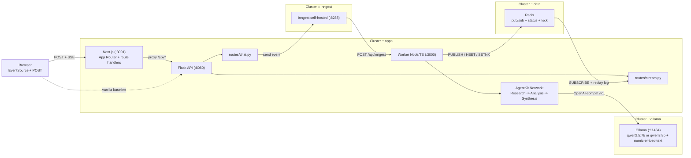
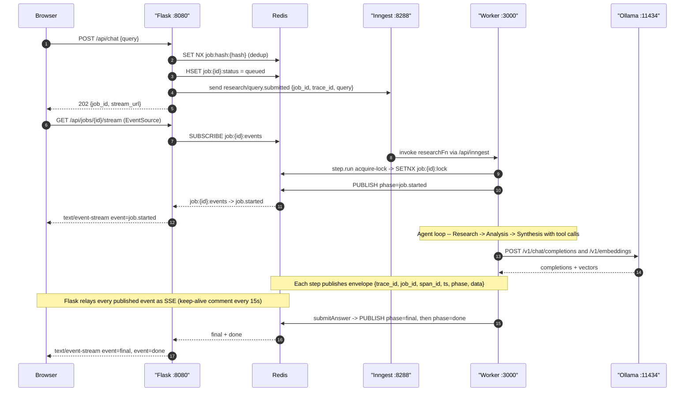
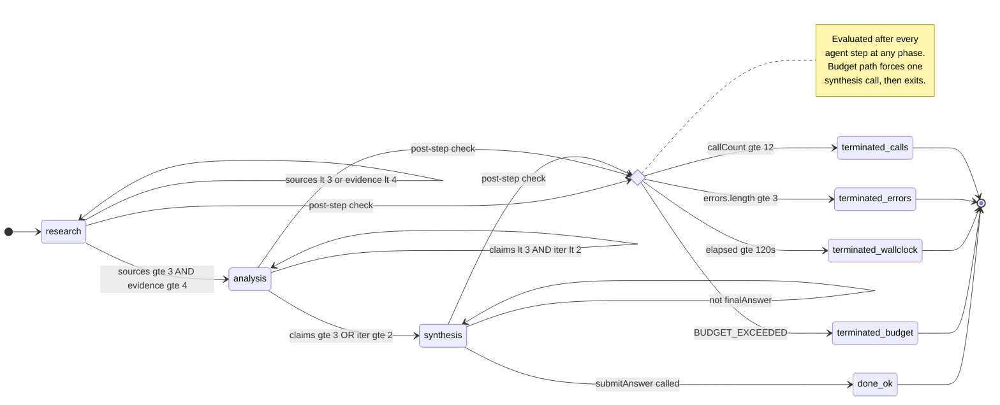

# Civo LLM Boilerplate — Async Research Agent

> A production-shaped implementation of the Grow Factory assessment brief.
> Flask API + Inngest AgentKit multi-agent Network (Research → Analysis →
> Synthesis) over self-hosted Ollama, on a Civo GPU Kubernetes cluster.
> SSE streaming, hybrid RAG, idempotent job dedup, full observability.

Forked from `growAssignments/_llmBoilerGrow2025` — upstream commits preserved.

---

## Live demo endpoints

Populated from `terraform output` after `apply`. Sample IPs from the current live deployment (Civo LON1, CPU node pool):

| Purpose | Example |
|---|---|
| **Primary UI (Next.js 15 + React 19)** | <http://74.220.21.49> |
| Vanilla UI + API (baseline) | <http://74.220.17.121> |
| POST endpoint | `http://74.220.17.121/api/chat` (direct) or `http://74.220.21.49/api/chat` (proxied) |
| Job stream (SSE) | `http://74.220.17.121/api/jobs/<id>/stream` |
| Inngest dashboard | <http://74.220.22.19:8288> |
| Open WebUI (Ollama) | <http://74.220.22.216> |

## Architecture

### System topology



State lives entirely in Redis:
`job:{id}:status` (HASH) · `job:{id}:events` (pub/sub) · `job:{id}:log` (LIST replay) · `job:{id}:lock` (SETNX + heartbeat) · `job:{id}:final` (terminal envelope).

Every log line + Redis envelope carries `{trace_id, job_id, span_id, parent_span_id, ts, phase}`.
See [`scripts/trace.sh`](scripts/trace.sh) for correlated tail.

### Request lifecycle



## The agent

**What it does (for a user):** takes a factual research question, searches the open web for authoritative sources, reads the top pages, and returns a cited answer as markdown with `[1]`, `[2]` reference links you can click. Not a general chatbot — it's optimised for "explain / define / compare" style queries where a cited answer beats a raw LLM guess.

### Sample queries that work well

- *"What is Ollama and what does it do?"*
- *"What is Server-Sent Events and when should you use it?"*
- *"Compare Redis Streams and Redis Pub/Sub."*
- *"What is a Kubernetes DaemonSet?"*
- *"What are the main features of Civo GPU Kubernetes clusters?"*

### What it deliberately doesn't do

- **Multi-turn conversation**: each `POST /api/chat` is single-shot. There's no session or memory across queries — by design, so responses stay reproducible under `Idempotency-Key`. Cross-session memory is called out as the next upgrade path in [ADR-006](docs/adr/006-hybrid-rag-in-memory-vs-vectordb.md).
- **Opinion or preference queries** ("what's the best…?"): the agent will search, but small-model synthesis is unreliable at value judgements.
- **Real-time data** (stock prices, live scores): source pages may be stale.

### Agent architecture

A 3-agent [AgentKit Network](https://agentkit.inngest.com/concepts/networks) behind a hybrid router.

- **ResearchAgent** — tools `webSearch`, `fetchUrl`. Gathers 2-4 primary sources.
- **AnalysisAgent** — tools `extractClaim`, `rateSourceCredibility`. Emits atomic claims + credibility scores.
- **SynthesisAgent** — tool `submitAnswer` (terminal). Writes the markdown answer with `[n]` citations.

### Agent decision policy

Each agent runs a dynamic system prompt rebuilt per turn from the current `NetworkState` + `BudgetTracker` snapshot. The policy the ResearchAgent actually follows:

1. **Only `fetchUrl` produces evidence.** A search alone doesn't advance the pipeline; always follow a search with a fetch.
2. **Only fetch URLs returned by `webSearch` this run.** Never invent or guess a URL.
3. **Rank results**: official docs / project site > primary reporting, `.gov`, `.edu` > everything else. Skip forums, SEO listicles, aggregators. One fetch per domain unless the budget allows more.
4. **Comparison queries** (`compare`, `vs`, `versus`, `difference between`): fetch one source per side before stopping.
5. **One tool call per turn.** No prose. When the goal is met or the budget is exhausted, reply `DONE`.
6. **The prompt shows remaining budget** (`webSearch calls left: N`, `fetchUrl calls left: M`) and **already-fetched URLs** so the model plans within actual constraints — not hallucinated ones.

The SynthesisAgent follows a parallel policy: produce a markdown answer 200-500 words, cite inline with `[n]`, structure comparison answers as a markdown table, and **always** call `submitAnswer` (never emit plain text — that's the only clean exit).

Router transitions (all thresholds env-tunable via `NETWORK_MIN_*` / `NETWORK_MAX_*`):

- `research → analysis` when `sources ≥ NETWORK_MIN_SOURCES && rawEvidence ≥ NETWORK_MIN_EVIDENCE`.
- `analysis → synthesis` when `claims ≥ NETWORK_MIN_CLAIMS || iteration ≥ NETWORK_MAX_ANALYSIS_ITERS`.
- Set `SKIP_ANALYSIS=true` to bypass the analysis phase (used on CPU deploys where each model call is expensive).
- Terminate on: `submitAnswer` called, `callCount ≥ NETWORK_MAX_CALLS`, `wall_clock ≥ NETWORK_WALL_CLOCK_MS`, or `errors.length ≥ 3`.

Model: `qwen2.5:7b` on CPU deploys (~5-8 tok/s), `qwen3:8b` on GPU deploys (~40-80 tok/s). Toggle via `ENABLE_GPU` (see [ADR-004](docs/adr/004-model-choice-qwen3-8b.md)).

### Network state machine



## Quickstart — local

Prereqs: Docker + Docker Compose. Runs entirely on CPU by default — a GPU only speeds up inference; nothing hard-requires it.

```bash
git clone https://github.com/kasasa22/_llmBoilerGrow2025
cd _llmBoilerGrow2025

# 1. Create a .env file at the repo root (gitignored) — controls the local stack
cat > .env <<'EOF'
MODEL_NAME=qwen2.5:7b
RAG_EMBED_MODEL=nomic-embed-text
INNGEST_EVENT_KEY=dev-key
LOG_LEVEL=info
SKIP_ANALYSIS=true
NETWORK_MIN_SOURCES=1
NETWORK_MAX_CALLS=6
MAX_TOOL_CALLS=4
MAX_FETCHES=2
MAX_SEARCH_QUERIES=1
MAX_WALL_CLOCK_MS=180000
EOF

# 2. Bring the full stack up (ollama + redis + inngest dev + worker + flask + web)
make up

# 3. Pull the chat + embedding models on first run (qwen2.5:7b ~4.7 GB, nomic ~274 MB)
make pull-models
# Override to a bigger model on GPU: `CHAT_MODEL=qwen3:8b make pull-models`

# 4. Open the UI
#    Next.js UI (primary):    http://localhost:3001
#    Vanilla UI (baseline):   http://localhost:8080
#    Inngest dashboard:       http://localhost:8288
#    Ollama Open WebUI:       http://localhost:3000
#    Ollama server (raw API): http://localhost:11434

# 5. Smoke test end-to-end (POST → SSE tail → assert final)
make smoke

# 6. Idempotency smoke (double-POST + worker-crash takeover)
make smoke-idem

# 7. Run the eval harness
make eval    # writes eval/results/<date>.md

# Shut down (keeps model volumes so next `up` is instant)
make down
```

The `.env` file is optional — docker-compose defaults kick in if it's missing — but you'll want it to tune budgets for slower CPUs or bump limits for GPU.

## Quickstart — Civo Kubernetes

Prereqs: [Civo account](https://dashboard.civo.com/signup) + API key, Terraform ≥ 1.9, `kubectl`, a [Terraform Cloud](https://app.terraform.io) free account.

### 1. Terraform Cloud workspace (one-time)

1. Sign in at [`app.terraform.io`](https://app.terraform.io) → **New organization** (any name, e.g. `myorg-llm`).
2. **New workspace** → **CLI-driven** → name it `llm-boilerplate`.
3. Workspace → **Settings** → **General** → **Execution Mode** = **Local (custom)** → **Save settings**.
   *State is stored in TF Cloud, apply runs on your machine — required so `kubectl`/`helm` can reach your cluster.*
4. Top-right avatar → **Account settings** → **Tokens** → **Create an API token** → copy it.
5. `terraform login` locally → paste the token when prompted.

### 2. Update providers.tf

Edit [`infra/tf/providers.tf`](infra/tf/providers.tf) to point at your workspace:

```hcl
cloud {
  organization = "myorg-llm"          # your org name from step 1
  workspaces {
    name = "llm-boilerplate"          # your workspace name
  }
}
```

### 3. Configure secrets

```bash
cp infra/tf/terraform.tfvars.example infra/tf/terraform.tfvars
# Edit infra/tf/terraform.tfvars and set:
#   civo_token          = "<your Civo API token>"
#   inngest_event_key   = "<32-hex; run: openssl rand -hex 32>"
#   inngest_signing_key = "<32-hex; NO 'signkey-prod-' prefix — that format is Cloud-only>"
#   tavily_api_key      = "<optional; empty falls back to DuckDuckGo scraping>"
#   enable_gpu          = false   # true when Civo GPU inventory available
```

### 4. Deploy

```bash
cd infra/tf
terraform init      # connects to TF Cloud, downloads providers
terraform apply     # ~10-15 min: cluster boot + helm releases + model pull
```

### 5. Read the URLs

```bash
terraform output
#   chat_url              = "<lb-ip>"       # Flask API + baseline UI
#   web_url               = "<lb-ip>"       # Next.js UI  ← primary demo URL
#   inngest_dashboard_url = "http://<lb-ip>:8288"
#   ollama_ui_service_ip  = "<lb-ip>"       # Open WebUI
```

### 6. Verify end-to-end

```bash
# Smoke against the live cluster
FLASK_URL=http://$(terraform output -raw chat_url) ../../scripts/smoke.sh

# Or in the browser: open http://<web_url>/, ask "What is Ollama?"
# Watch the Inngest dashboard for the run tree.
```

**Note on `deploy_app`**: unlike the upstream boilerplate this defaults to `true` — the whole stack ships together. Set to `false` in `terraform.tfvars` if you only want Ollama + Open WebUI.

## CI/CD

Pushes to `main` that touch `app/**`, `web/**`, or `infra/**` trigger `.github/workflows/deploy.yml`:

1. Build & push **three** images to GHCR (`llm-boilerplate-app`, `llm-boilerplate-worker`, `llm-boilerplate-web`), tagged with both `:${sha}` and `:latest`.
2. `terraform apply` with `TF_VAR_*_image_tag=${sha}` so every push forces a rollout of all three services.
3. `terraform output -json` is dumped into `$GITHUB_STEP_SUMMARY` — the reviewer sees `web_url` and `chat_url` on the workflow page.

Required GitHub **secrets** (Settings → Secrets and variables → Actions):

- `CIVO_TOKEN`
- `INNGEST_EVENT_KEY`, `INNGEST_SIGNING_KEY` (raw hex; no `signkey-prod-` prefix)
- `TAVILY_API_KEY` (optional; empty falls back to DuckDuckGo)
- `TF_API_TOKEN` (Terraform Cloud user API token — enables persistent state across CI runs)

Required GitHub **variables** (same page, Variables tab):

- `ENABLE_GPU` — `true` to provision `g4g.40.kube.small` (1×A100 40GB) with the GPU Operator; `false` for a `g4s.kube.large` CPU node running `qwen2.5:7b`. Defaults to `true` if unset.

### Manual recovery inputs

The workflow_dispatch has two opt-in checkboxes for infra recovery — leave both **unchecked** for normal runs:

- **`force_replace_cluster`** — destroy + recreate the Civo cluster. Only needed when changing node size or hardware profile (Civo doesn't allow in-place pool resize). Adds ~6 minutes.
- **`force_replace_helm`** — `terraform state rm` all helm releases so they reinstall fresh. Use after a cluster rebuild if TF Cloud state is out of sync with the fresh cluster.

### When you flip ENABLE_GPU

Changing the `ENABLE_GPU` GH variable is a **hardware profile change** — Civo can't resize a pool in place, so the next `terraform apply` will fail with `Size change ("size") for existing cluster is not available at this moment` unless you tell it to destroy + recreate.

**Required flow when flipping `ENABLE_GPU`:**

1. Toggle `ENABLE_GPU` at `Settings → Secrets and variables → Actions → Variables → ENABLE_GPU`
2. **Actions → Build and Deploy → Run workflow ▼**
3. **✅ Check `Destroy and recreate the Civo cluster`**
4. **✅ Check `Reinstall all helm releases`**
5. Click **Run workflow**

Both boxes are required together: the cluster destroy leaves stale helm-release entries in TF Cloud state, and reinstall clears them so the fresh cluster gets a clean helm install.

**Also check GPU inventory first before flipping to `true`** — Civo LON1 A100 availability has been intermittent:

```bash
CIVO_TOKEN="<your-token>"
curl -sS -H "Authorization: bearer $CIVO_TOKEN" \
  "https://api.civo.com/v2/kubernetes/available-nodes?region=LON1" \
  | python3 -c "import json,sys; d=json.load(sys.stdin); [print(n['name'], 'gpu=', n.get('gpu_count',0)) for n in d if 'g4g' in n.get('name','')]"
```

If it doesn't show `gpu_count=1`, don't flip yet — the apply will destroy your CPU cluster and then fail with `gpu_count_exceeded`, leaving you with no live cluster.

### Remote state (Terraform Cloud)

`infra/tf/providers.tf` has a `cloud {}` block pointing at the `kasasa22-llm/llm-boilerplate` workspace. Execution mode is **Local** — TF Cloud stores state, the GH Actions runner runs `apply`. This prevents the `DatabaseNetworkExistsError` you'd otherwise hit on every retry (CI runners are ephemeral, so without remote state each run starts from scratch and tries to recreate resources that already exist).

**GHCR image visibility**: on first push the images at `ghcr.io/kasasa22/*` default to
private. Flip them to public at
`https://github.com/users/kasasa22/packages/container/llm-boilerplate-app/settings`
(and `-worker`, `-web`) so the K8s node can pull without an `imagePullSecret`.

## Environment variables

Defaults shown are for CPU deploys (`ENABLE_GPU=false`). GPU deploys relax `NETWORK_MIN_*` and `MAX_TOOL_CALLS` since inference is 8-10× faster.

| Name | Default (CPU) | Owner | Purpose |
|---|---|---|---|
| `ENABLE_GPU` | `false` | infra | Provision GPU node pool + NVIDIA GPU Operator; switch chat model to `qwen3:8b` |
| `MODEL_NAME` | `qwen2.5:7b` | app + worker | Chat model (auto: `qwen3:8b` when `ENABLE_GPU=true`) |
| `APP_ENV` | `demo` | web | Rendered in the UI badge; `prod` on GPU deploys |
| `SKIP_ANALYSIS` | `true` | worker | Bypass the Analysis phase (single model call cost matters on CPU) |
| `RAG_ENABLED` | `true` | worker | Kill-switch → fall back to first-8k-chars |
| `RAG_EMBED_MODEL` | `nomic-embed-text` | worker | Ollama embedding model |
| `NETWORK_MAX_CALLS` | `6` | worker | Router callCount cap |
| `NETWORK_WALL_CLOCK_MS` | `180000` | worker | `network.run` deadline |
| `NETWORK_MIN_SOURCES` | `1` | worker | Research→Synthesis handoff floor |
| `MAX_TOOL_CALLS` | `4` | worker | Budget guard |
| `MAX_FETCHES` | `2` | worker | Per-run fetchUrl cap |
| `MAX_SEARCH_QUERIES` | `1` | worker | Per-run webSearch cap |
| `MAX_WALL_CLOCK_MS` | `180000` | worker | Total wall-clock per run |
| `ALLOWED_DOMAINS` | *(empty = open web)* | worker | CSV eTLD+1 allowlist |
| `DENIED_DOMAINS` | *(empty)* | worker | Applied AFTER allowlist |
| `LOG_LEVEL` | `info` | app + worker | JSON log verbosity |
| `TRACE_ID_HEADER` | `x-trace-id` | app | Response header for `POST /api/chat` |

### GPU vs CPU deployment

The `ENABLE_GPU` toggle is the single source of truth for hardware profile. Terraform locals in [`infra/tf/locals.tf`](infra/tf/locals.tf) derive four things from it atomically:

| Setting | `ENABLE_GPU=true` | `ENABLE_GPU=false` |
|---|---|---|
| Node pool size | `g4g.40.kube.small` (1×A100 40GB) | `g4s.kube.large` (4 vCPU, 8GB) |
| NVIDIA GPU Operator | Installed via Helm | Skipped (`count = 0`) |
| Ollama chart `gpu.enabled` | `true` | `false` |
| Chat model pulled by Ollama | `qwen3:8b` (~5GB) | `qwen2.5:7b` (~4.7GB) |

Why the CPU fallback exists: Civo GPU inventory (LON1 only for the 63GB RAM quota) is intermittently exhausted with `gpu_count_exceeded` from the API. Setting `ENABLE_GPU=false` keeps the assignment-required Civo deployment path unchanged while removing the inventory dependency. See ADR-004 for the model rationale.

> **Flipping this variable requires cluster replacement** — Civo doesn't allow in-place node pool resize. See the [When you flip ENABLE_GPU](#when-you-flip-enable_gpu) section under CI/CD for the required workflow_dispatch flow.

## Idempotency

`POST /api/chat` is idempotent against retries. Optionally send an
`Idempotency-Key: <8..128 chars, [A-Za-z0-9._~-]>` header:

- **202** (fresh): `{"job_id", "stream_url", "idempotent": false}` + `Idempotency-Status: created`.
- **200** (dedup hit): `{"job_id", "idempotent": true}` + `Idempotency-Status: replayed`. Client should reconnect to the same stream URL.
- **409** (conflict): same key with a different body → `{"error":"idempotency_key_reuse"}`.
- **400**: malformed key.

On the worker side, `SETNX job:{id}:lock` prevents double execution; a Lua CAS lets a
fresh worker take over a stale lock. Every SSE event carries a monotonic `seq` so
`Last-Event-ID` reconnection is deterministic. Details in [ADR-007](docs/adr/007-idempotency-strategy-outbox-lite.md).

## Cost controls

Runaway agents burn GPU minutes. Every run is bounded by six env-driven limits
enforced by `BudgetTracker` (`app/worker/src/budget.ts`):

`MAX_TOOL_CALLS` · `MAX_FETCHES` · `MAX_SEARCH_QUERIES` · `MAX_CONTEXT_CHARS` · `MAX_WALL_CLOCK_MS` · `MAX_TOKENS_PER_CALL`.

On any limit hit, the run emits `BUDGET_EXCEEDED`, then a **forced-synthesis** path
produces a partial answer from evidence-so-far and terminates with `final: partial=true`.

To adjust per environment: change the Terraform var → Helm value chain (`env` block in
`infra/helm/worker/values.yaml`) rather than `helm upgrade --set` in-place.

## API reference

### POST /api/chat

Submits a research query. Non-blocking: returns immediately with a `job_id` and a stream URL. The actual agent runs in the background via Inngest.

**Request:**

```http
POST /api/chat
Content-Type: application/json
Idempotency-Key: <optional; 8..128 chars, [A-Za-z0-9._~-]>

{
  "query": "What is Ollama and what does it do?"
}
```

**Validation:**

- `query` — required, string, 1..2000 chars after trim.
- `Idempotency-Key` — optional; if omitted, dedup uses `sha256(normalized_query)`.

**Responses:**

| Status | When | Body | Headers |
|---|---|---|---|
| **202 Created** | Fresh submission | `{"job_id","stream_url","idempotent":false}` | `Idempotency-Status: created`, `x-trace-id: <32-hex>` |
| **200 OK** | Duplicate: same key, same body | `{"job_id","stream_url","idempotent":true}` | `Idempotency-Status: replayed` |
| **400 Bad Request** | Missing/malformed `query` or `Idempotency-Key` | `{"error":"...", "detail":"..."}` | — |
| **409 Conflict** | Same key, different body | `{"error":"idempotency_key_reuse"}` | — |

### GET /api/jobs/{job_id}/stream

Server-Sent Events stream for a submitted job. One connection per browser tab; the server sends every event published to `job:{id}:events` in Redis, plus a replay of the log for any events that fired before the subscription connected.

**Response** (`Content-Type: text/event-stream`, `X-Accel-Buffering: no`):

```text
id: 1
event: job.started
data: {"seq":1,"phase":"job.started","trace_id":"...","job_id":"...","ts":"...","data":{"query":"..."}}

id: 2
event: tool.called
data: {"seq":2,"phase":"tool.called","data":{"tool":"webSearch","args":{...}}}

...

id: 14
event: final
data: {"seq":14,"phase":"final","data":{"answer":"...", "citations":[{"n":1,"url":"..."}]}}

id: 15
event: done
data: {"seq":15,"phase":"done","data":{"state":"done"}}
```

Every 15s a `: keep-alive` comment is sent so Civo's LB idle timeout doesn't close the connection.

### GET /healthz

Liveness probe. Returns `200 OK` with `{"status":"ok"}` when the Flask app can reach Redis.

### Response delivery mechanism (why SSE)

The brief mentions "webhooks, polling, or WebSocket" — we chose **Server-Sent Events**:

| Option | Chosen? | Why |
|---|---|---|
| **SSE** | ✅ | Unidirectional (server → client) matches the "job publishes events" pattern. Works over plain HTTP, browser-native `EventSource`, Civo LB compatible. No CORS complications with same-origin proxy. |
| Polling | ❌ | Cheap to implement but awful UX for 30-60s pipelines. Would need `GET /api/jobs/{id}` every 500ms. |
| Webhook | ❌ | Requires the client to expose an HTTP endpoint — impossible for browsers. Would fit a service-to-service integration but not this brief. |
| WebSocket | ❌ | Overkill: we don't need client → server messages after the initial POST. Adds an upgrade handshake, sticky routing on the LB, and reconnection code. SSE covers the same use case with less machinery. |

## Verify end-to-end

The brief explicitly asks that the app can communicate with the in-cluster Ollama server. Quick verification chain, top to bottom:

```bash
# 1. Cluster is healthy
kubectl get pods -A | grep -v Running   # expect no output

# 2. Ollama is serving the chat model
kubectl -n ollama exec -it deploy/ollama -- ollama list
# → qwen2.5:7b (or qwen3:8b on GPU) + nomic-embed-text

# 3. Worker → Ollama connectivity from inside the cluster
kubectl -n apps exec -it deploy/worker -- \
  wget -qO- http://ollama.ollama.svc.cluster.local:11434/api/tags
# → JSON list of models

# 4. Flask → Inngest → Worker end-to-end from outside
FLASK_URL=http://$(terraform -chdir=infra/tf output -raw chat_url) scripts/smoke.sh
# → posts a query, tails SSE, asserts a final event with citations arrives
```

## Error codes

See [`docs/errors.md`](docs/errors.md) for the full taxonomy — retry policy per code,
sample SSE payload, and UI treatment.

## Traceability

Every request mints a `trace_id` (32-hex) in Flask on `POST /api/chat` and threads it
through the Inngest event payload, the worker's Redis publishes, and every log line on
both sides. Response header `x-trace-id` returns it to the client.

Tail merged logs by `trace_id`:

```bash
# local
make trace T=<trace_id>

# cluster
MODE=k8s scripts/trace.sh <trace_id>
```

Fields mirror W3C traceparent shape (`trace_id` / `span_id` / `parent_span_id`) so an
OpenTelemetry follow-up PR needs no renames. OTel not shipped now — reviewer's ask is
fully satisfied by log-based trace_id.

## Evaluation

`eval/dataset.jsonl` has 8 curated cases. Each hits `POST /api/chat`, tails SSE to the
terminal event, then scores per case:

- `has_final_answer`, `tool_calls`, `fetches`, `citations_count`.
- `citations_from_expected_domains` — the primary quality gate.
- `expected_facts_hit`, `wall_clock_ms`, `budget_hits`, `errors`.

```bash
make eval                                  # local
EVAL_URL=http://<lb-ip> make eval          # cluster
```

CI: `.github/workflows/eval.yml` runs on `workflow_dispatch`; results uploaded as
artefact + posted to job summary.

## Example requests

```bash
# Fresh submission
curl -sS -X POST http://<chat_url>/api/chat \
     -H 'content-type: application/json' \
     -d '{"query":"What Kubernetes GPU node options does Civo offer?"}'
# {"job_id":"job_a3f8c1", "stream_url":"/api/jobs/job_a3f8c1/stream", "idempotent":false}

# With idempotency key
curl -sS -X POST http://<chat_url>/api/chat \
     -H 'content-type: application/json' \
     -H 'Idempotency-Key: bosmart-2026-09-14-01' \
     -d '{"query":"..."}'

# Tail the stream
curl -N http://<chat_url>/api/jobs/job_a3f8c1/stream
# id: 1
# event: job.started
# data: {"seq":1,"phase":"job.started","trace_id":"...","job_id":"job_a3f8c1", ...}
# id: 2
# event: agent.transition
# data: {"seq":2,"phase":"agent.transition","data":{"from":"research","to":"analysis"}}
# ...
# event: final
# data: {..."answer":"...","citations":[{"n":1,"url":"..."}]}
# event: done
```

## Design notes and trade-offs (the "why")

Every decision below has a one-page ADR under [`docs/adr/`](docs/adr/). This section is
the elevator pitch; the ADRs have the alternatives-considered detail.

### Why async / event-driven instead of sync request/response

Model calls take 10-60 s. A synchronous request ties up a gunicorn worker and dies on
Civo's LB idle timeout (~60 s). Decoupling with Inngest event + SSE gives free retry,
replay, and observability. Link: [ADR-001](docs/adr/001-two-service-flask-plus-ts-worker.md).

### Why Inngest AgentKit vs a raw workflow queue vs LangGraph

Raw BullMQ/Celery gives queues but nothing about agent state or tool calls. LangGraph is
Python-first and would force us to rebuild `createNetwork`. AgentKit gives durable
`step.run` + retries + a UI the reviewer can inspect mid-demo. Link: [ADR-003](docs/adr/003-inngest-agentkit-multi-agent-network.md).

### Why a multi-agent Network vs one agent with tools

Even for one agent, `createNetwork` gives typed state + a router seam + free
step-boundary durability. Cost is one extra router prompt; benefit is testable phase
transitions and a screenshot-worthy Inngest step tree. Link: [ADR-003](docs/adr/003-inngest-agentkit-multi-agent-network.md).

### Why self-hosted Inngest vs Inngest Cloud

Reviewer must open the dashboard mid-Loom without signing up. Signing/event keys stay
in-cluster. Trade-off: OSS build has no built-in auth, so the LB is demo-only. Link:
[ADR-002](docs/adr/002-self-hosted-inngest-vs-cloud.md).

### Why Redis pub/sub vs Inngest Realtime vs Postgres LISTEN/NOTIFY

Postgres would drag in a whole DB dependency. Inngest Realtime is beta and couples
transport to orchestrator. Redis pub/sub + `LPUSH` log gives fan-out + replay in one
dep we already need for status + idempotency. Link: [ADR-005](docs/adr/005-redis-pubsub-for-sse-fanout.md).

### Why qwen2.5:7b on CPU (qwen3:8b on GPU) vs llama3.3 vs gemma3:4b

Single GPU rules out 70B. `llama3.2:3b` was tested but produces malformed tool_calls that
fail Zod validation, causing endless Inngest retries. `gemma3:4b` drops `arguments` on
tool_calls under load. `qwen2.5:7b` and `qwen3:8b` both have strong tool-calling; picked
qwen2.5:7b for CPU because it's ~500MB smaller and starts faster. Link:
[ADR-004](docs/adr/004-model-choice-qwen3-8b.md).

### Why in-memory RAG vs pgvector or Qdrant

Stateless per job — no cross-session memory required. pgvector adds a chart + PVC +
secret + backup story. ADR names pgvector as the first upgrade path when cross-session
memory arrives. Link: [ADR-006](docs/adr/006-hybrid-rag-in-memory-vs-vectordb.md).

### Why gunicorn + gevent for SSE

SSE holds one connection per active job for tens of seconds. Sync workers exhaust at
~8 concurrent users on a default 4-worker config. Gevent gives 1000+ green-threaded
connections per worker at near-zero CPU cost while blocked on Redis. Trade-off: no
accidental blocking calls — we use `redis-py` with monkey-patched sockets and no other
blockers in the request path.

### Why Next.js 15 App Router on top of a vanilla-JS-capable backend

Two UIs live side-by-side. The vanilla `app/templates/index.html` (~450 lines,
zero build step) proves the async SSE architecture works without a framework. The
Next.js UI at `web/` adds a typed component model — Server Component page shell,
`"use client"` interactive subtree, TypeScript discriminated union of the 25 SSE
phases — that scales better as the UI grows. Concretely:
`web/app/api/chat/route.ts` proxies the browser's POST to Flask server-side so
**the browser never crosses an origin and no CORS setup is needed**, and
`web/app/api/jobs/[id]/stream/route.ts` streams the SSE body straight back. Link:
[ADR-009](docs/adr/009-nextjs-frontend.md).

## Development timeline

Dated arc of how this submission was built. Reviewers can cross-reference commits in `git log`.

- **Sat 2026-09-12** — Backend (Flask + Node/TS AgentKit worker), Helm charts, Terraform, 100-test suite (74 vitest + 26 pytest), 8 MADR ADRs, evaluation harness, docs. All local CI green.
- **Sun 2026-09-13 morning** — Local docker-compose stack verified end-to-end via `make up` + `make smoke`. Multi-agent Network (Research → Analysis → Synthesis) observed transitioning live in the SSE stream.
- **Sun 2026-09-13 afternoon — Civo deployment iteration:**
  - `g4s.kube.small` boilerplate default is CPU-only despite "g4" naming (Civo API confirms `gpu_count=0`). Switched to `g4g.40.kube.small` (1×A100 40GB).
  - Account RAM quota (63GB) rules out NYC1's L40S SKU (96GB). Stayed on LON1.
  - Civo LON1 A100 40GB inventory returned `gpu_count_exceeded`. Built `ENABLE_GPU=false` toggle so the assignment-required Civo deployment path stays intact on CPU nodes.
  - Replaced boilerplate's manual NVIDIA device-plugin DaemonSet with the NVIDIA GPU Operator Helm chart v25.10.1 per Civo's official docs.
- **Sun 2026-09-13 evening** — Next.js 15 App Router UI added as an additive service (typed SSE envelope, Server + Client Component split, route handler proxy so no CORS on Flask). Vanilla UI retained as baseline. See [ADR-009](docs/adr/009-nextjs-frontend.md).
- **Sun 2026-09-13 evening → Mon 2026-09-14 morning — infrastructure hardening:**
  - Added Terraform Cloud remote state (`cloud {}` block in providers.tf) — CI runners are ephemeral, without persisted state every retry hit `DatabaseNetworkExistsError`.
  - Civo provider's `kubernetes_version` validator rejected the API-returned `talos-v1.5.0` on refresh. Added `-refresh=false` on plan/apply and pinned the version format Civo now returns.
  - Inngest OSS binary needed `command: [inngest, start, ...]` in the Helm deployment — the image has empty ENTRYPOINT, so `args:` alone tried to exec `start` as a binary.
  - Inngest `start` command needs raw-hex signing keys, not the `signkey-prod-` prefixed Cloud format. Documented in the tfvars example.
  - Two-phase apply added to `deploy.yml` for node-size changes (`force_replace_cluster` workflow_dispatch input): destroy + recreate cluster targeted first, then apply everything else so `data "kubernetes_service"` reads see a valid endpoint.
- **Mon 2026-09-14 mid-day — model + agent tuning:**
  - Node bumped from `g4s.kube.medium` (2 vCPU / 4GB) to `g4s.kube.large` (4 vCPU / 8GB) after the small node OOMkilled the kubelet under Ollama + Redis + Inngest + Worker + Flask + Web + Ollama-UI.
  - Chat model swapped from `llama3.2:3b` (produced malformed tool_calls) to `qwen2.5:7b` (reliable structured output). Ollama chart re-pulled models.
  - `retries: 0` on the Inngest function to stop retry storms during CPU inference. Aggressive budget cuts (`SKIP_ANALYSIS=true`, `MAX_TOOL_CALLS=4`, `MAX_FETCHES=2`).
  - Forced-synthesis fallback wired to fire whenever synthesis returns without `submitAnswer` (previously only fired on the specific `BudgetExceeded` exception).
  - `publish-job-started` wrapped in `step.run` for deterministic single-fire — eliminates the visible "job.started × N" repetition from Inngest step replay.
- **Mon 2026-09-14 evening → Tue 2026-09-15** — Loom recording, README polish, final verify + submit.

## Troubleshooting

- **`terraform apply` looks stuck on the ollama release.**
  First pull of `qwen2.5:7b` + `nomic-embed-text` is ~5 GB from Ollama's registry. Timeout in `infra/tf/helm-ollama.tf` is set generously.

- **LoadBalancer IP is `pending`.**
  Civo provisions the LB after the pod is Ready. Give it 60-90s.

- **`DatabaseNetworkExistsError` on retry.**
  Fixed by Terraform Cloud remote state — see CI/CD section. If deploying without TF Cloud, delete the orphan network via `curl -X DELETE .../v2/networks/<id>?region=LON1` before retrying.

- **`gpu_count_exceeded` from Civo API.**
  Real inventory shortage. Set the `ENABLE_GPU` GH variable to `false` and re-run; the cluster will provision on CPU nodes with `qwen2.5:7b`.

- **Inngest pod `CrashLoopBackOff` with `exec: "start": executable file not found`.**
  The `inngest/inngest` image has empty ENTRYPOINT. Ensure the Helm deployment uses `command: [inngest, start, ...]`, not `args: [start, ...]`.

- **Inngest crash with `signing-key must be hex string`.**
  The `INNGEST_SIGNING_KEY` secret has a `signkey-prod-` prefix (Inngest Cloud format). Self-hosted needs raw 64-hex.

- **`Size change for existing cluster is not available`.**
  Civo doesn't support in-place pool resize. Trigger the workflow_dispatch with `force_replace_cluster=true`.

- **Node `NotReady`, all pods offline.**
  Almost always OOM under `g4s.kube.medium` (4GB) — the whole stack doesn't fit. Bump `cpu_cluster_node_size` to `g4s.kube.large` (8GB) and retrigger with `force_replace_cluster=true`.

- **`webSearch` returns 0 results.**
  DuckDuckGo scraper is broken this week. Set `TAVILY_API_KEY` GH secret to a free-tier Tavily key.

- **Agent loops without producing a final answer.**
  qwen2.5:7b on CPU sometimes stalls in synthesis without calling `submitAnswer`. The forced-synthesis fallback kicks in on budget exhaustion and builds an answer from source titles + citations so the UI always renders something.

- **SSE closes at 60s idle.**
  Confirm you're seeing `: keep-alive` comments in the stream. Flask sets `X-Accel-Buffering: no` and gunicorn runs with the gevent worker.

- **`kubectl` says `ImagePullBackOff`.**
  GHCR image is still private — flip it to public (see CI section) or add `imagePullSecrets` in the Helm chart.

## Cleanup

```bash
cd infra/tf
terraform destroy
```

Or via GitHub Actions: run the manual `Destroy Terraform Managed Infrastructure`
workflow.

## Screenshots

Captured during the Loom walkthrough — see `docs/screenshots/` in the repo.

- `chat-ui.png` — Next.js UI mid-run: agent transitions, RAG chunks indexed, final answer with citations.
- `inngest.png` — Inngest dashboard step tree: `acquire-lock`, `publish-job-started`, `ResearchAgent`, `SynthesisAgent` with real timings.
- `webui.png` — Open WebUI hitting `qwen2.5:7b` (CPU) directly.

## Repository map

```text
_llmBoilerGrow2025/
├── app/                       # Flask (Python) + Node/TS worker
│   ├── config.py logging_config.py trace.py redis_bus.py idempotency.py
│   ├── inngest_client.py wsgi.py main.py
│   ├── routes/                # chat.py stream.py health.py ui.py
│   ├── templates/  static/    # baseline HTML/JS/CSS
│   ├── requirements.txt Dockerfile
│   └── worker/                # Node/TS AgentKit worker
│       ├── src/
│       │   ├── agents/{research,analysis,synthesis}.ts
│       │   ├── tools/{webSearch,fetchUrl,urlPolicy,extractClaim,
│       │   │         rateSourceCredibility,submitAnswer}.ts
│       │   ├── rag/{chunker,embedder,retriever,types}.ts
│       │   ├── functions/research.ts
│       │   ├── config.ts events.ts errors.ts budget.ts trace.ts
│       │   ├── logger.ts redis.ts idempotency.ts inngestClient.ts
│       │   └── state.ts network.ts index.ts
│       └── package.json tsconfig.json Dockerfile
├── web/                       # Next.js 15 App Router UI
│   ├── app/{layout,page}.tsx  # Server Component page shell
│   ├── app/api/chat/route.ts  # POST proxy to Flask (same-origin, no CORS)
│   ├── app/api/jobs/[id]/stream/route.ts  # SSE passthrough
│   ├── components/{ChatPanel,QueryForm,EventTimeline,AnswerPanel,...}.tsx
│   ├── hooks/{useJobStream,useIdempotencyKey}.ts
│   ├── lib/{events,phases,env,api,markdown}.ts
│   ├── package.json tsconfig.json next.config.ts Dockerfile
├── infra/
│   ├── helm/{app,worker,web,inngest,ollama-ui}/
│   └── tf/*.tf                # cloud {} block → Terraform Cloud remote state
├── docs/
│   ├── errors.md
│   └── adr/{001..009}-*.md
├── eval/                      # dataset + driver + scoring + report
├── scripts/                   # smoke.sh smoke-idempotency.sh trace.sh
├── .github/workflows/         # deploy.yml lint-*.yml eval.yml
├── docker-compose.yml Makefile
└── __README.MD  (this file)
```

## License / Attribution

Adapted from `growAssignments/_llmBoilerGrow2025`. Additions © 2026 Trevor Kasasa.
