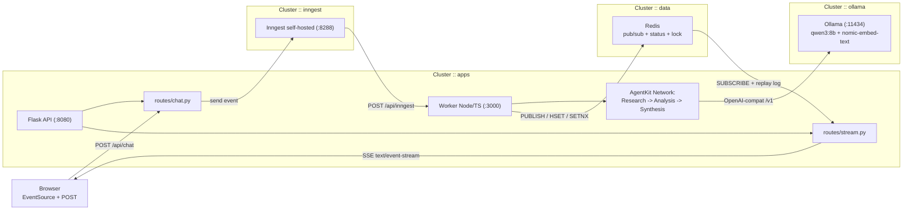
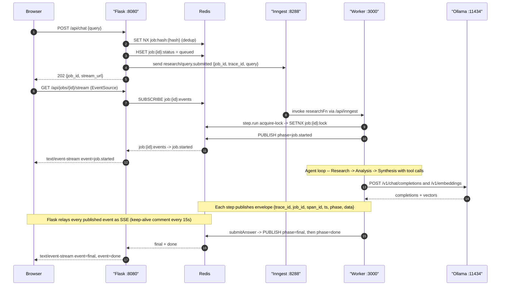

# Civo LLM Boilerplate — Async Research Agent

> A production-shaped implementation of the Grow Factory assessment brief.
> Flask API + Inngest AgentKit multi-agent Network (Research → Analysis →
> Synthesis) over self-hosted Ollama, on a Civo GPU Kubernetes cluster.
> SSE streaming, hybrid RAG, idempotent job dedup, full observability.

Forked from `growAssignments/_llmBoilerGrow2025` — upstream commits preserved.

---

## Live demo endpoints

Populated from `terraform output` after `apply`.

| Purpose | URL |
|---|---|
| Chat UI + API | `http://<chat_url>/` |
| POST endpoint | `http://<chat_url>/api/chat` |
| Job stream (SSE) | `http://<chat_url>/api/jobs/<id>/stream` |
| Job status | `http://<chat_url>/api/jobs/<id>` |
| Inngest dashboard | `http://<inngest_dashboard_url>:8288` |
| Open WebUI (Ollama) | `http://<ollama_ui_service_ip>/` |

## Architecture

### System topology



State lives entirely in Redis:
`job:{id}:status` (HASH) · `job:{id}:events` (pub/sub) · `job:{id}:log` (LIST replay) · `job:{id}:lock` (SETNX + heartbeat) · `job:{id}:final` (terminal envelope).

Every log line + Redis envelope carries `{trace_id, job_id, span_id, parent_span_id, ts, phase}`.
See [`scripts/trace.sh`](scripts/trace.sh) for correlated tail.

### Request lifecycle



## The agent

A 3-agent [AgentKit Network](https://agentkit.inngest.com/concepts/networks) behind a hybrid router.

- **ResearchAgent** — tools `webSearch`, `fetchUrl`. Gathers 3-6 primary sources.
- **AnalysisAgent** — tools `extractClaim`, `rateSourceCredibility`. Emits atomic claims + credibility scores.
- **SynthesisAgent** — tool `submitAnswer` (terminal). Writes the markdown answer with `[n]` citations.

Router transitions:
- `research → analysis` when `sources ≥ 3 && rawEvidence ≥ 4`.
- `analysis → synthesis` when `claims ≥ 3 || iteration ≥ 2`.
- Terminate on: `submitAnswer` called, `callCount ≥ 12`, `wall_clock ≥ 120s`, or `errors.length ≥ 3`.

Model: `qwen3:8b` (see [ADR-004](docs/adr/004-model-choice-qwen3-8b.md)).

### Network state machine


## Quickstart — local

Prereqs: Docker + Docker Compose + a GPU or accept slower CPU inference.

```bash
git clone https://github.com/kasasa22/_llmBoilerGrow2025
cd _llmBoilerGrow2025

# 1. Bring stack up (ollama + redis + inngest dev + worker + flask)
make up

# 2. Pull the models (once; qwen3:8b is ~5 GB, nomic-embed-text ~274 MB)
make pull-models

# 3. Open http://localhost:8080 and ask a research question.
#    Watch the Inngest dashboard at http://localhost:8288

# 4. Smoke test end-to-end
make smoke

# 5. Idempotency smoke (double-POST + worker-crash takeover)
make smoke-idem

# 6. Run the eval harness
make eval    # writes eval/results/<date>.md
```

## Quickstart — Civo Kubernetes

Prereqs: [Civo account](https://dashboard.civo.com/signup), Civo API key, Terraform ≥ 1.9, `kubectl`.

```bash
# 1. Fill in secrets
cp infra/tf/terraform.tfvars.example infra/tf/terraform.tfvars
# Edit and set:
#   civo_token            = "<your Civo API token>"
#   inngest_event_key     = "<32-hex; openssl rand -hex 32>"
#   inngest_signing_key   = "signkey-prod-<32-hex>"
#   tavily_api_key        = "<optional; falls back to DuckDuckGo>"

# 2. Deploy
cd infra/tf
terraform init
terraform apply     # ~15-20 min first time (GPU node + model pulls)

# 3. Read the outputs
terraform output
#   chat_url             = "<lb-ip>"
#   inngest_dashboard_url = "http://<lb-ip>:8288"
#   ollama_ui_service_ip  = "<lb-ip>"

# 4. Smoke against the live cluster
FLASK_URL=http://$(terraform output -raw chat_url) ../../scripts/smoke.sh
```

Then browse `http://<chat_url>/`, ask a question, and watch the run tree in the Inngest dashboard.

## CI/CD

Pushes to `main` that touch `app/**` or `infra/**` trigger `.github/workflows/deploy.yml`:

1. Build & push **two** images to GHCR (`llm-boilerplate-app`, `llm-boilerplate-worker`), tagged with both `:${sha}` and `:latest`.
2. `terraform apply` with `TF_VAR_app_image_tag=${sha}` so every push forces a rollout.
3. `terraform output -json` is dumped into `$GITHUB_STEP_SUMMARY` — the reviewer sees `chat_url` on the workflow page.

Required GitHub secrets:

- `CIVO_TOKEN`
- `INNGEST_EVENT_KEY`, `INNGEST_SIGNING_KEY`
- `TAVILY_API_KEY` (optional)
- `EVAL_URL` (for the workflow_dispatch eval action)

**GHCR image visibility**: on first push the images at `ghcr.io/kasasa22/*` default to
private. Flip them to public at
`https://github.com/users/kasasa22/packages/container/llm-boilerplate-app/settings`
(and `-worker`) so the K8s node can pull without an `imagePullSecret`.

## Environment variables

All env vars are documented alongside the plan file. Highlights:

| Name | Default | Owner | Purpose |
|---|---|---|---|
| `MODEL_NAME` | `qwen3:8b` | app + worker | Chat model |
| `RAG_ENABLED` | `true` | worker | Kill-switch → fall back to first-8k-chars |
| `RAG_EMBED_MODEL` | `nomic-embed-text` | worker | Ollama embedding model |
| `NETWORK_MAX_CALLS` | `12` | worker | Router callCount cap |
| `NETWORK_WALL_CLOCK_MS` | `120000` | worker | `network.run` deadline |
| `MAX_TOOL_CALLS` | `10` | worker | Budget guard |
| `MAX_WALL_CLOCK_MS` | `90000` | worker | Total wall-clock per run |
| `ALLOWED_DOMAINS` | *(empty = open web)* | worker | CSV eTLD+1 allowlist |
| `DENIED_DOMAINS` | *(empty)* | worker | Applied AFTER allowlist |
| `LOG_LEVEL` | `info` | app + worker | JSON log verbosity |
| `TRACE_ID_HEADER` | `x-trace-id` | app | Response header for `POST /api/chat` |

## Idempotency

`POST /api/chat` is idempotent against retries. Optionally send an
`Idempotency-Key: <8..128 chars, [A-Za-z0-9._~-]>` header:

- **202** (fresh): `{"job_id", "stream_url", "idempotent": false}` + `Idempotency-Status: created`.
- **200** (dedup hit): `{"job_id", "idempotent": true}` + `Idempotency-Status: replayed`. Client should reconnect to the same stream URL.
- **409** (conflict): same key with a different body → `{"error":"idempotency_key_reuse"}`.
- **400**: malformed key.

On the worker side, `SETNX job:{id}:lock` prevents double execution; a Lua CAS lets a
fresh worker take over a stale lock. Every SSE event carries a monotonic `seq` so
`Last-Event-ID` reconnection is deterministic. Details in [ADR-007](docs/adr/007-idempotency-strategy-outbox-lite.md).

## Cost controls

Runaway agents burn GPU minutes. Every run is bounded by six env-driven limits
enforced by `BudgetTracker` (`app/worker/src/budget.ts`):

`MAX_TOOL_CALLS` · `MAX_FETCHES` · `MAX_SEARCH_QUERIES` · `MAX_CONTEXT_CHARS` · `MAX_WALL_CLOCK_MS` · `MAX_TOKENS_PER_CALL`.

On any limit hit, the run emits `BUDGET_EXCEEDED`, then a **forced-synthesis** path
produces a partial answer from evidence-so-far and terminates with `final: partial=true`.

To adjust per environment: change the Terraform var → Helm value chain (`env` block in
`infra/helm/worker/values.yaml`) rather than `helm upgrade --set` in-place.

## Error codes

See [`docs/errors.md`](docs/errors.md) for the full taxonomy — retry policy per code,
sample SSE payload, and UI treatment.

## Traceability

Every request mints a `trace_id` (32-hex) in Flask on `POST /api/chat` and threads it
through the Inngest event payload, the worker's Redis publishes, and every log line on
both sides. Response header `x-trace-id` returns it to the client.

Tail merged logs by `trace_id`:

```bash
# local
make trace T=<trace_id>

# cluster
MODE=k8s scripts/trace.sh <trace_id>
```

Fields mirror W3C traceparent shape (`trace_id` / `span_id` / `parent_span_id`) so an
OpenTelemetry follow-up PR needs no renames. OTel not shipped now — reviewer's ask is
fully satisfied by log-based trace_id.

## Evaluation

`eval/dataset.jsonl` has 8 curated cases. Each hits `POST /api/chat`, tails SSE to the
terminal event, then scores per case:

- `has_final_answer`, `tool_calls`, `fetches`, `citations_count`.
- `citations_from_expected_domains` — the primary quality gate.
- `expected_facts_hit`, `wall_clock_ms`, `budget_hits`, `errors`.

```bash
make eval                                  # local
EVAL_URL=http://<lb-ip> make eval          # cluster
```

CI: `.github/workflows/eval.yml` runs on `workflow_dispatch`; results uploaded as
artefact + posted to job summary.

## Example requests

```bash
# Fresh submission
curl -sS -X POST http://<chat_url>/api/chat \
     -H 'content-type: application/json' \
     -d '{"query":"What Kubernetes GPU node options does Civo offer?"}'
# {"job_id":"job_a3f8c1", "stream_url":"/api/jobs/job_a3f8c1/stream", "idempotent":false}

# With idempotency key
curl -sS -X POST http://<chat_url>/api/chat \
     -H 'content-type: application/json' \
     -H 'Idempotency-Key: bosmart-2026-09-14-01' \
     -d '{"query":"..."}'

# Tail the stream
curl -N http://<chat_url>/api/jobs/job_a3f8c1/stream
# id: 1
# event: job.started
# data: {"seq":1,"phase":"job.started","trace_id":"...","job_id":"job_a3f8c1", ...}
# id: 2
# event: agent.transition
# data: {"seq":2,"phase":"agent.transition","data":{"from":"research","to":"analysis"}}
# ...
# event: final
# data: {..."answer":"...","citations":[{"n":1,"url":"..."}]}
# event: done
```

## Design notes and trade-offs (the "why")

Every decision below has a one-page ADR under [`docs/adr/`](docs/adr/). This section is
the elevator pitch; the ADRs have the alternatives-considered detail.

### Why async / event-driven instead of sync request/response

Model calls take 10-60 s. A synchronous request ties up a gunicorn worker and dies on
Civo's LB idle timeout (~60 s). Decoupling with Inngest event + SSE gives free retry,
replay, and observability. Link: [ADR-001](docs/adr/001-two-service-flask-plus-ts-worker.md).

### Why Inngest AgentKit vs a raw workflow queue vs LangGraph

Raw BullMQ/Celery gives queues but nothing about agent state or tool calls. LangGraph is
Python-first and would force us to rebuild `createNetwork`. AgentKit gives durable
`step.run` + retries + a UI the reviewer can inspect mid-demo. Link: [ADR-003](docs/adr/003-inngest-agentkit-multi-agent-network.md).

### Why a multi-agent Network vs one agent with tools

Even for one agent, `createNetwork` gives typed state + a router seam + free
step-boundary durability. Cost is one extra router prompt; benefit is testable phase
transitions and a screenshot-worthy Inngest step tree. Link: [ADR-003](docs/adr/003-inngest-agentkit-multi-agent-network.md).

### Why self-hosted Inngest vs Inngest Cloud

Reviewer must open the dashboard mid-Loom without signing up. Signing/event keys stay
in-cluster. Trade-off: OSS build has no built-in auth, so the LB is demo-only. Link:
[ADR-002](docs/adr/002-self-hosted-inngest-vs-cloud.md).

### Why Redis pub/sub vs Inngest Realtime vs Postgres LISTEN/NOTIFY

Postgres would drag in a whole DB dependency. Inngest Realtime is beta and couples
transport to orchestrator. Redis pub/sub + `LPUSH` log gives fan-out + replay in one
dep we already need for status + idempotency. Link: [ADR-005](docs/adr/005-redis-pubsub-for-sse-fanout.md).

### Why qwen3:8b vs llama3.3 vs gemma3:4b

Single GPU rules out 70 B. gemma3:4b drops `arguments` on tool_calls under load.
qwen3:8b fits, has strong tool-calling, is already in the boilerplate's default_models.
Link: [ADR-004](docs/adr/004-model-choice-qwen3-8b.md).

### Why in-memory RAG vs pgvector or Qdrant

Stateless per job — no cross-session memory required. pgvector adds a chart + PVC +
secret + backup story. ADR names pgvector as the first upgrade path when cross-session
memory arrives. Link: [ADR-006](docs/adr/006-hybrid-rag-in-memory-vs-vectordb.md).

### Why gunicorn + gevent for SSE

SSE holds one connection per active job for tens of seconds. Sync workers exhaust at
~8 concurrent users on a default 4-worker config. Gevent gives 1000+ green-threaded
connections per worker at near-zero CPU cost while blocked on Redis. Trade-off: no
accidental blocking calls — we use `redis-py` with monkey-patched sockets and no other
blockers in the request path.

## Troubleshooting

- **`terraform apply` looks stuck for 10 minutes on the ollama release.**
  First pull of `qwen3:8b` + `nomic-embed-text` is ~5 GB from Ollama's registry.
  `kubectl -n ollama logs -f pod/…` will show the progress. Timeout in
  `infra/tf/helm-ollama.tf` is set generously.

- **LoadBalancer IP is `pending`.**
  Civo provisions the LB after the pod is Ready. Give it 60-90 s.

- **SSE closes at 60 s idle.**
  Confirm you're seeing `: keep-alive` comments in the stream. The Flask response sets
  `X-Accel-Buffering: no` and gunicorn runs with the gevent worker.

- **Empty search results / `SEARCH_ERROR`.**
  DuckDuckGo occasionally rate-limits. Set `TAVILY_API_KEY` for a free-tier alternative.

- **Agent loops.**
  `NETWORK_MAX_CALLS=12` and `MAX_WALL_CLOCK_MS=90000` prevent it. If you're seeing the
  budget fire, raise them via TF vars only after you've inspected the Inngest step
  tree.

- **`kubectl` says `ImagePullBackOff` on the app or worker.**
  GHCR image is still private — flip it to public (see CI section) or add
  `imagePullSecrets` in the Helm chart.

## Cleanup

```bash
cd infra/tf
terraform destroy
```

Or via GitHub Actions: run the manual `Destroy Terraform Managed Infrastructure`
workflow.

## Screenshots

*(add these while recording the Loom walkthrough)*

- `docs/screenshots/chat-ui.png` — the chat UI mid-run showing agent transitions and citations.
- `docs/screenshots/inngest.png` — Inngest dashboard step tree for a completed run.
- `docs/screenshots/webui.png` — Open WebUI hitting `qwen3:8b` directly (proves the GPU is real).
- `docs/screenshots/eval-report.png` — rendered `eval/results/<date>.md`.
- `docs/screenshots/trace.png` — `scripts/trace.sh` merged Flask+worker timeline.

## Repository map

```
_llmBoilerGrow2025/
├── app/                       # Flask (Python) + Node/TS worker
│   ├── config.py logging_config.py trace.py redis_bus.py idempotency.py
│   ├── inngest_client.py wsgi.py main.py
│   ├── routes/                # chat.py stream.py health.py ui.py
│   ├── templates/  static/    # HTML/JS/CSS
│   ├── requirements.txt Dockerfile
│   └── worker/                # Node/TS AgentKit worker
│       ├── src/
│       │   ├── agents/{research,analysis,synthesis}.ts
│       │   ├── tools/{webSearch,fetchUrl,urlPolicy,extractClaim,
│       │   │         rateSourceCredibility,submitAnswer}.ts
│       │   ├── rag/{chunker,embedder,retriever,types}.ts
│       │   ├── functions/research.ts
│       │   ├── config.ts events.ts errors.ts budget.ts trace.ts
│       │   ├── logger.ts redis.ts idempotency.ts inngestClient.ts
│       │   ├── state.ts network.ts index.ts
│       │   └── (agent.ts REPLACED-BY network.ts + agents/*.ts)
│       ├── package.json tsconfig.json Dockerfile
├── infra/
│   ├── helm/{app,worker,inngest,ollama-ui}/
│   └── tf/*.tf
├── docs/
│   ├── errors.md
│   └── adr/{001..008}-*.md
├── eval/                      # dataset + driver + scoring + report
├── scripts/                   # smoke.sh smoke-idempotency.sh trace.sh
├── .github/workflows/         # deploy.yml lint-*.yml eval.yml delete.yml
├── docker-compose.yml Makefile
└── __README.MD  (this file)
```

## License / Attribution

Adapted from `growAssignments/_llmBoilerGrow2025`. Additions © 2026 Trevor Ssuuna.
